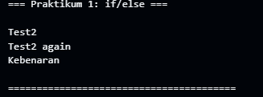
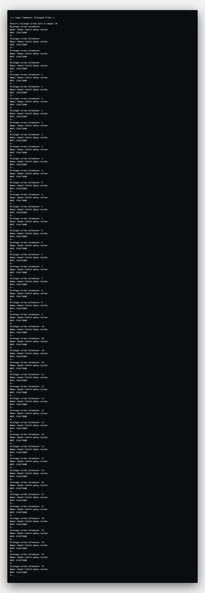

# Laporan Tugas Praktikum: Pengantar Bahasa Pemrograman Dart (Bagian 2)

## Praktikum 1: Menerapkan Control Flows (if/else)

Praktikum ini berfokus pada penggunaan pernyataan `if/else` dan pentingnya tipe data boolean dalam kondisi.

**Kode Asli (Bermasalah):**
```dart
String test = "true";
if (test) {
    print("Kebenaran");
}
```

**Kode yang Telah Diperbaiki:**
```dart
String test = "true";
if (test == "true") {
    print("Kebenaran");
}
```

**Penjelasan:**  
Kode asli mengalami error karena Dart membutuhkan ekspresi boolean (`true` atau `false`) di dalam kondisi `if`. Variabel `test` bertipe `String` dengan nilai `"true"`, bukan `bool`. Solusinya adalah dengan membandingkan nilai string-nya secara eksplisit.

**Tampilan hasil praktikum 1:**  
*Output program setelah perbaikan kode if/else*



---

## Praktikum 2: Menerapkan Perulangan (while dan do-while)

Praktikum ini membahas perulangan `while` dan `do-while`, serta masalah inisialisasi variabel.

**Kode Asli (Bermasalah):**
```dart
while (counter < 33) {
    print(counter);
    counter++;
}
```

**Kode yang Telah Diperbaiki:**
```dart
int counter = 0;
while (counter < 33) {
    print(counter);
    counter++;
}
```

**Penjelasan:**  
Kode asli mengalami error karena variabel `counter` tidak pernah dideklarasikan atau diinisialisasi. Solusinya adalah dengan menambahkan `int counter = 0;` sebelum perulangan dimulai.

**Tampilan hasil praktikum 2:**  
*Output program setelah perbaikan kode perulangan while*


---

## Praktikum 3: Menerapkan Perulangan (for dan break/continue)

Praktikum ini berfokus pada perulangan `for` dan penggunaan `break` serta `continue`.

**Kode Asli (Bermasalah):**
```dart
for (Index = 10; index < 27; index++) {
    print(Index);
}
```

**Kode yang Telah Diperbaiki:**
```dart
for (int index = 10; index < 27; index++) {
    print(index);
}
```

**Penjelasan:**  
Kode ini mengalami error karena Dart bersifat case-sensitive. Variabel `Index` (huruf kapital) berbeda dengan `index` (huruf kecil). Solusinya adalah dengan menggunakan nama variabel yang konsisten dan mendeklarasikan tipe datanya (`int`).

**Tampilan hasil praktikum 3:**  
*Output program setelah perbaikan kode perulangan for*


---

## Tugas Tambahan: Program Bilangan Prima

Tugas ini mengharuskan pembuatan program untuk menemukan bilangan prima dari 0 hingga 201.

### Kode Program
```dart
print('Mencari bilangan prima dari 0 sampai 201...');

for (int i = 2; i <= 201; i++) {
    if (isPrima(i)) {
        print('Bilangan prima ditemukan: $i');
        print('Nama: $nama');
        print('NIM: $nim');
        print('---');
    }
}

bool isPrima(int number) {
    if (number <= 1) {
        return false;
    }
    for (int i = 2; i <= number / 2; i++) {
        if (number % i == 0) {
            return false;
        }
    }
    return true;
}
```

**Penjelasan:**  
Program ini menggunakan `for loop` untuk mengiterasi angka dari 2 hingga 201. Untuk setiap angka, fungsi `isPrima()` dipanggil untuk memeriksa apakah angka tersebut prima. Jika hasilnya `true`, program akan mencetak bilangan prima beserta nama dan NIM Anda. Fungsi `isPrima` bekerja dengan memeriksa apakah angka memiliki faktor pembagi selain 1 dan dirinya sendiri.

**Tampilan hasil tugas bilangan prima:**  
*Output program pencarian bilangan prima*

