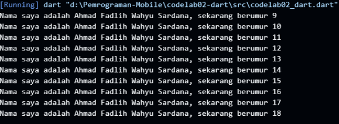
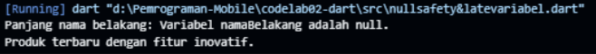

# Laporan Tugas Praktikum Pengantar Bahasa Pemrograman Dart (Bagian 1)

Tugas ini berisi jawaban dan laporan untuk tugas praktikum pengantar bahasa pemrograman Dart.

---

## **1. Soal Modifikasi Kode**

**Tugas:**  
Modifikasi kode perulangan `for` agar menghasilkan output sesuai yang diminta.

**Jawaban:**  
Kode yang dimodifikasi terdapat pada folder `src/`.

```dart
void main() {
    for (int i = 0; i < 10; i++) {
        print('Nama saya adalah [Nama Anda], sekarang berumur ${i + 9}');
    }
}
```

Penjelasan:  
Ekspresi `${i + 9}` digunakan untuk menghasilkan urutan umur dari 9 hingga 18, sesuai dengan perulangan dari `i = 0` sampai `9`.



---

## **2. Soal Pemahaman Bahasa Pemrograman Dart**

**Pertanyaan:**  
Mengapa sangat penting untuk memahami bahasa pemrograman Dart sebelum kita menggunakan framework Flutter? Jelaskan!

**Jawaban:**  
Memahami Dart sangat penting karena Dart adalah bahasa pemrograman yang digunakan oleh Flutter. Semua logika, widget, dan fungsionalitas aplikasi Flutter ditulis dalam Dart. Tanpa memahami Dart, mustahil untuk membangun aplikasi Flutter.

---

## **3. Soal Rangkuman Materi**

**Pertanyaan:**  
Rangkumlah materi dari codelab ini menjadi poin-poin penting yang dapat Anda gunakan untuk membantu proses pengembangan aplikasi mobile menggunakan framework Flutter.

**Jawaban:**

- **Fungsi `main()`:** Titik awal eksekusi program.
- **Variabel dan Tipe Data:** Dart type-safe (`var`, `String`, `int`) dan memiliki kata kunci `final`/`const` untuk variabel yang tidak bisa diubah.
- **Perulangan (`for`, `while`):** Berguna untuk membuat daftar widget secara dinamis.
- **String Interpolation:** Menggunakan `${variabel}` untuk menyisipkan nilai variabel ke dalam teks, sangat efisien untuk UI dinamis.

---

## **4. Soal Null Safety dan Late Variabel**

**Pertanyaan:**  
Buatlah penjelasan dan contoh eksekusi kode tentang perbedaan Null Safety dan Late variabel!

**Jawaban:**

- **Null Safety:**  
    Fitur Dart untuk mencegah error dari variabel yang bernilai `null`. Variabel harus diberi tanda `?` (mis. `String?`) jika bisa bernilai `null`.

- **Late Variabel:**  
    Kata kunci `late` menandakan bahwa variabel akan diinisialisasi nantinya sebelum digunakan pertama kali. Ini berguna untuk variabel yang nilainya belum tersedia saat deklarasi.

**Contoh Kode:**

```dart
// Kode ini menunjukkan Null Safety dan Late Variabel
void main() {
    // Contoh Null Safety:
    String? namaBelakang; // Variabel ini bisa null
    // print(namaBelakang.length); // Error! Karena variabel bisa null

    // Kita harus melakukan pengecekan null sebelum menggunakannya
    if (namaBelakang != null) {
        print('Panjang nama belakang: ${namaBelakang.length}');
    } else {
        print('Variabel namaBelakang adalah null.');
    }

    // Contoh Late Variabel:
    late String deskripsiProduk;
    
    // Asumsikan di sini ada operasi yang membutuhkan waktu
    // dan baru bisa menginisialisasi variabel
    deskripsiProduk = 'Produk terbaru dengan fitur inovatif.';
    
    // Karena sudah diinisialisasi, variabel 'deskripsiProduk' aman untuk digunakan
    print(deskripsiProduk);
}
```


