# Tugas Praktikum Flutter Fundamental (Part 1)

## Identitas
- Nama: **Ahmad Fadlih Wahyu Sardana**  
- NIM: **2341720069**  
- Kelas: **TI-3F**  
- No Absen: **03**

---

## Daftar Isi
1. [Praktikum 1 – Membuat Project Flutter Baru](#praktikum-1--membuat-project-flutter-baru)  
2. [Praktikum 2 – Menjalankan di Perangkat Fisik / Emulator](#praktikum-2--menjalankan-di-perangkat-fisik--emulator)  
3. [Praktikum 3 – Git & GitHub + Dokumentasi](#praktikum-3--git--github--dokumentasi)  
4. [Praktikum 4 – Widget Dasar](#praktikum-4--widget-dasar)  
5. [Praktikum 5 – Material & Cupertino Widgets](#praktikum-5--material--cupertino-widgets)  
6. [Tugas Tambahan – Namer App](#tugas-tambahan--namer-app)  
7. [Struktur Folder](#struktur-folder)  
8. [Potongan Kode Penting](#potongan-kode-penting)  
9. [Konfigurasi Aset](#konfigurasi-aset)  
10. [Catatan](#catatan)  

---

## Praktikum 1 – Membuat Project Flutter Baru
Langkah:
1. Buka VS Code → Ctrl + Shift + P → ketik "Flutter" → pilih "New Application Project".  
2. Pilih folder kerja.  
3. Masukkan nama: `hello_world`.  
4. Setelah selesai muncul pesan: "Your Flutter Project is ready!".  

<p align="center"></p>
<p align="center"></p>
<p align="center">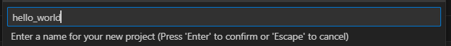</p>
<p align="center">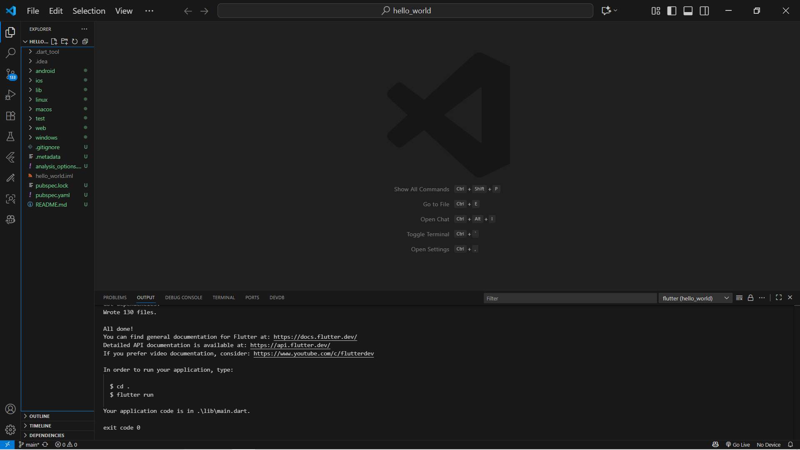</p>

---

## Praktikum 2 – Menjalankan di Perangkat Fisik / Emulator
Pastikan device terdeteksi (`flutter devices`). Jalankan:  
```
flutter run
```
<p align="center"></p>

---

## Praktikum 3 – Git & GitHub + Dokumentasi
Ringkas alur:
1. Buat repo GitHub: `flutter-fundamental-part1`.  
2. Inisialisasi di project:
  ```
  git init
  git remote add origin <url>
  git add .gitignore
  git commit -m "tambah gitignore"
  git push -u origin main
  ```
3. Tambah & commit `README.md`.  
4. Stage & push seluruh file project:  
  ```
  git add .
  git commit -m "project hello_world"
  git push
  ```
5. Jalankan aplikasi, ubah text menjadi nama lengkap, screenshot → simpan `images/01.png`.  


Cuplikan:
<p align="center">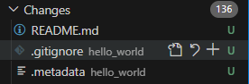 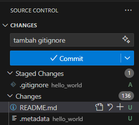 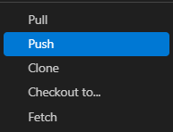</p>
<p align="center"></p>
<p align="center"></p>
<p align="center">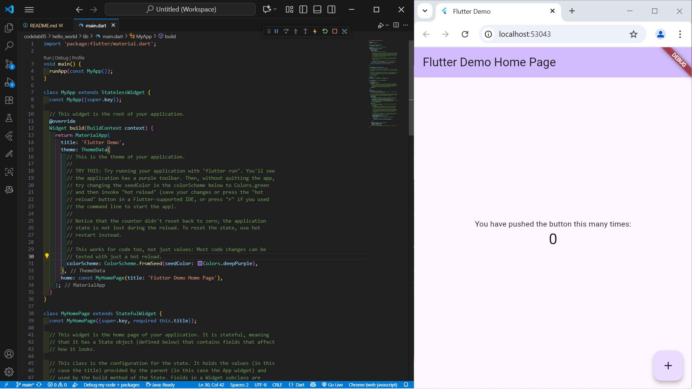</p>
<p align="center">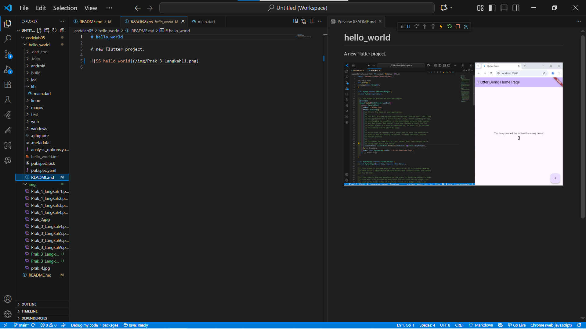</p>

---

## Praktikum 4 – Widget Dasar

### 1. Text Widget
`text_widget.dart` menampilkan teks dengan gaya khusus.  
<p align="center">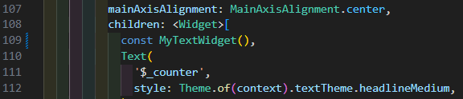</p>
<p align="center"></p>

### 2. Image Widget
Menampilkan aset lokal.  
<p align="center">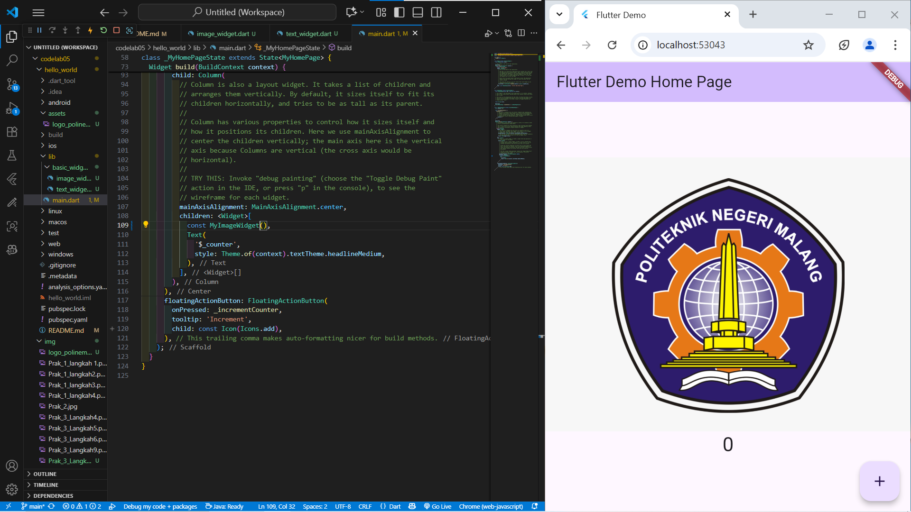</p>

---

## Praktikum 5 – Material & Cupertino Widgets

### 1. Cupertino Button & Loading
<p align="center"></p>

### 2. Floating Action Button
<p align="center"></p>

### 3. Scaffold + FAB + Counter
<p align="center"></p>

### 4. Dialog (AlertDialog)
<p align="center">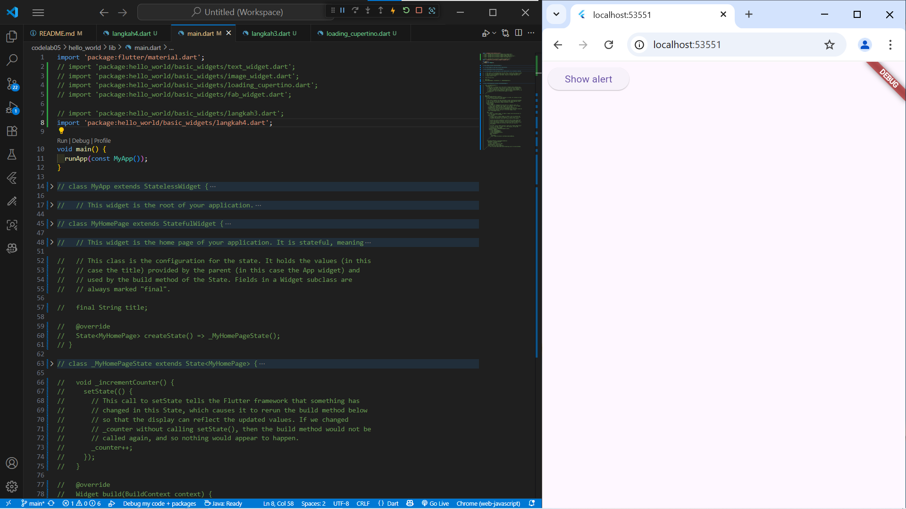</p>
<p align="center"></p>

### 5. Input (TextField)
<p align="center">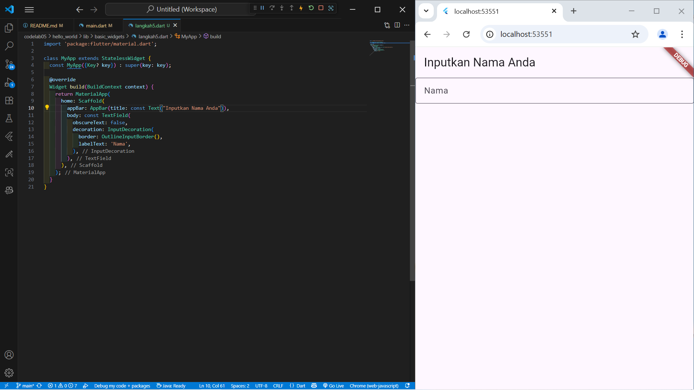 </p>

### 6. Date Picker
<p align="center"></p>
<p align="center"></p>
<p align="center"></p>

---

## Tugas Tambahan – Namer App
Hasil modifikasi codelab (favorit, navigasi, identitas ditampilkan).
<p align="center"></p>
<p align="center"></p>
<p align="center"></p>

---

## Struktur Folder
```
lib/
  main.dart
  basic_widgets/
   text_widget.dart
   image_widget.dart
   loading_cupertino.dart
   fab_widget.dart
   scaffold_example.dart
   dialog_example.dart
   input_example.dart
   date_picker_example.dart
```

---

## Potongan Kode Penting

Text Widget:
```dart
class MyTextWidget extends StatelessWidget {
  const MyTextWidget({super.key});
  @override
  Widget build(BuildContext context) {
   return const Text(
    'Nama saya Ahmad Fadlih Wahyu Sardana, sedang belajar Pemrograman Mobile',
    style: TextStyle(color: Colors.red, fontSize: 14),
    textAlign: TextAlign.center,
   );
  }
}
```

Image Widget:
```dart
class MyImageWidget extends StatelessWidget {
  const MyImageWidget({super.key});
  @override
  Widget build(BuildContext context) {
   return const Image(image: AssetImage('logo_polinema.jpg'));
  }
}
```

Cupertino + Loading:
```dart
CupertinoButton(onPressed: () {}, child: const Text('Contoh button'));
const CupertinoActivityIndicator();
```

FAB:
```dart
FloatingActionButton(
  onPressed: () {},
  backgroundColor: Colors.pink,
  child: const Icon(Icons.thumb_up),
);
```

Dialog:
```dart
showDialog(
  context: context,
  builder: (_) => AlertDialog(
   title: const Text('My title'),
   content: const Text('This is my message.'),
   actions: [TextButton(onPressed: ()=>Navigator.pop(context), child: const Text('OK'))],
  ),
);
```

Input:
```dart
const TextField(
  decoration: InputDecoration(
   border: OutlineInputBorder(),
   labelText: 'Nama',
  ),
);
```

Date Picker (fungsi inti):
```dart
final picked = await showDatePicker(
  context: context,
  initialDate: selectedDate,
  firstDate: DateTime(2015, 8),
  lastDate: DateTime(2101),
);
if (picked != null) setState(()=> selectedDate = picked);
```

---

## Konfigurasi Aset
pubspec.yaml:
```
flutter:
  assets:
   - logo_polinema.jpg
```

---

## Catatan
- Jalankan hanya satu fungsi `main()` aktif (komentari lainnya saat demonstrasi).  
- Gunakan commit pesan deskriptif: contoh "add text widget", "add date picker".  
- Pastikan screenshot berjalan di device fisik (Praktikum 2).  
- Pisahkan tiap contoh widget dalam file modular (sesuai instruksi).  

Selesai.  
