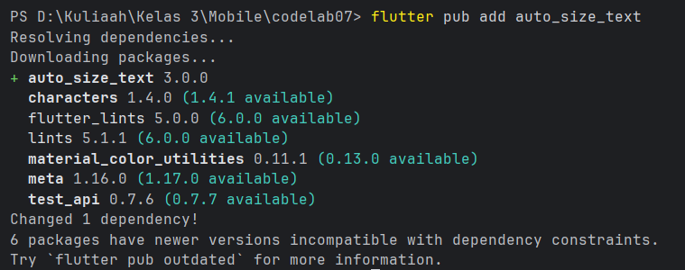
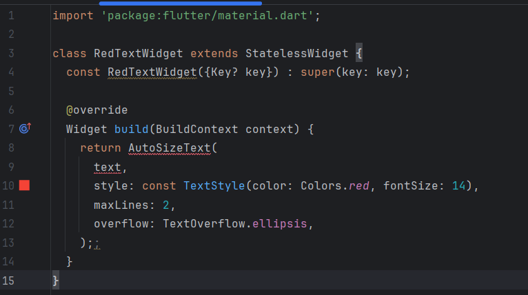
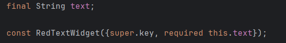
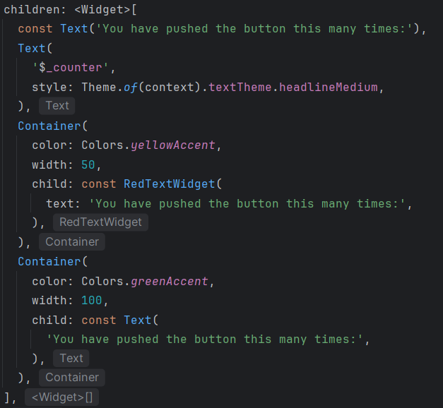
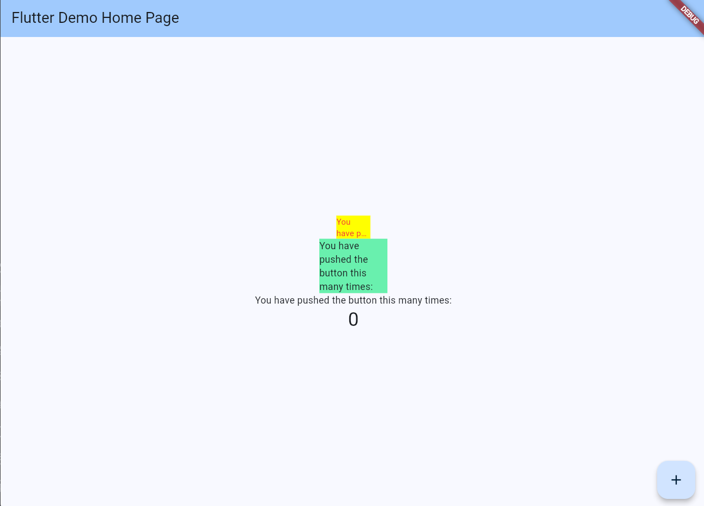

# Laporan Jobsheet 07 — Manajemen Plugin

## Identitas

- **Nama** : Ahmad Fadlih Wahyu Sardana
- **NIM**  : 2341720069
- **Kelas**: TI-3F

---

## Ringkasan Praktikum

Pada jobsheet ini kita mempelajari bagaimana menambahkan dan menggunakan plugin pihak ketiga di Flutter, yaitu `auto_size_text`. Tujuan praktikum adalah membuat widget teks yang dapat menyesuaikan ukuran font secara otomatis sehingga muat di wadahnya.

## Langkah Pelaksanaan

1. Tambahkan dependency `auto_size_text` ke `pubspec.yaml` dan jalankan `flutter pub get`.

   

2. Buat file `lib/src/red_text_widget.dart` yang memanfaatkan `AutoSizeText`.

   

   Catatan: pastikan menambahkan import:

   ```dart
   import 'package:auto_size_text/auto_size_text.dart';
   ```

3. Tambahkan variabel `text` dan parameter pada konstruktor agar widget dapat menerima teks dari luar.

   

4. Panggil widget kustom di `main.dart` dan bandingkan dengan `Text` default.

   

5. Jalankan aplikasi dan amati hasilnya.

   

---

## Tugas Praktikum

1. Jelaskan maksud dari langkah 2 pada praktikum tersebut!
2. Jelaskan maksud dari langkah 5 pada praktikum tersebut!
3. Pada langkah 6 terdapat dua widget yang ditambahkan, jelaskan fungsi dan perbedaannya!
4. Jelaskan maksud dari tiap parameter yang ada di dalam plugin auto_size_text berdasarkan tautan pada dokumentasi ini!

## Jawaban Tugas Praktikum

1. Maksud dari langkah 2 pada praktikum tersebut adalah untuk menambahkan plugin `auto_size_text` ke dalam `pubspec.yaml` agar dapat digunakan dalam proyek Flutter. Setelah menambahkan dependency, jalankan `flutter pub get` di terminal agar paket diunduh dan siap dipakai. Menambahkan paket memungkinkan kita menggunakan widget `AutoSizeText` yang berfungsi menyesuaikan ukuran teks secara otomatis ketika ruang terbatas.

2. Maksud dari langkah 5 pada praktikum tersebut adalah membuat widget menjadi dapat menerima teks dari luar melalui konstruktor sehingga menjadi dinamis dan dapat digunakan ulang. Implementasinya meliputi:

- Menambahkan variabel `final String text;` untuk menyimpan nilai teks yang dikirim.
- Menambahkan konstruktor seperti `const RedTextWidget({Key? key, required this.text}) : super(key: key);` sehingga saat widget dipanggil, parameter `text` wajib diberikan.

Kata kunci `final` memastikan nilai tidak berubah setelah inisialisasi, `required` menandakan parameter wajib, dan `super(key: key)` meneruskan `key` ke kelas induk `StatelessWidget`.

1. Pada langkah tersebut ada dua widget yang dibandingkan:

- `RedTextWidget`: Widget kustom yang menggunakan `AutoSizeText`. Fungsinya menampilkan teks berwarna merah dan menyesuaikan ukuran font otomatis agar muat di dalam lebar kontainer. Cocok ketika teks bisa lebih panjang dan kita ingin menjaga keterbacaan tanpa overflow.
- `Text`: Widget bawaan Flutter yang menampilkan teks statis tanpa penyesuaian ukuran otomatis; jika teks lebih panjang daripada ruang tersedia dan `maxLines` terbatas, teks akan dipotong atau menimbulkan overflow (tergantung properti lain).

Perbedaan utama: `RedTextWidget` otomatis menyesuaikan ukuran font (responsif terhadap ruang), sedangkan `Text` statis dan tidak mengubah ukuran font.

1. Penjelasan tiap parameter (ringkasan terperinci) pada plugin `auto_size_text`:

| No. | Properti | Deskripsi | Catatan / Fungsionalitas |
| :-: | :--- | :--- | :--- |
| 1 | `key` | Key standar widget yang mengontrol identitas widget di tree. | Gunakan untuk testing atau penggantian widget secara terkontrol. |
| 2 | `textKey` | Key khusus untuk widget `Text` internal yang dibuat oleh `AutoSizeText`. | Berguna saat perlu mengakses atau menguji `Text` internal. |
| 3 | `style` | `TextStyle` (warna, ukuran dasar, font, berat). | `AutoSizeText` akan menyesuaikan ukuran berdasarkan style awal ini. |
| 4 | `minFontSize` | Ukuran font minimum saat penyesuaian. | Jika teks tetap tidak muat, `overflowReplacement` dapat digunakan. |
| 5 | `maxFontSize` | Ukuran font maksimum untuk penyesuaian. | Berguna untuk membatasi skala teks ketika ruang besar. |
| 6 | `stepGranularity` | Langkah penurunan/peningkatan ukuran saat mencari ukuran yang pas. | Nilai lebih kecil → penyesuaian lebih halus tapi lebih mahal komputasinya. |
| 7 | `presetFontSizes` | Daftar ukuran font yang dicoba secara berurutan (harus diurutkan menurun). | Lebih deterministik daripada pencarian kontinu. |
| 8 | `group` | Objek `AutoSizeGroup` untuk menyinkronkan ukuran beberapa `AutoSizeText`. | Berguna untuk konsistensi ukuran teks di beberapa widget. |
| 9 | `textAlign` | Perataan horizontal teks (`TextAlign.left/center/right`). | Sama seperti di widget `Text` biasa. |
| 10 | `textDirection` | Arah penulisan (`ltr` / `rtl`). | Penting untuk bahasa dengan arah berbeda. |
| 11 | `locale` | Lokalisasi untuk rendering teks. | Mengontrol perilaku rendering karakter tertentu. |
| 12 | `softWrap` | Apakah teks boleh membungkus baris secara otomatis. | Jika false, teks akan mencoba tetap di satu baris. |
| 13 | `wrapWords` | Menentukan apakah kata yang tidak muat boleh dipotong. | Jika false, kata akan dipindahkan utuh ke baris berikutnya. |
| 14 | `overflow` | Cara menampilkan teks yang meluap (`TextOverflow.ellipsis`, dll). | Default akan memotong atau menambah ellipsis sesuai pengaturan. |
| 15 | `overflowReplacement` | Widget pengganti yang ditampilkan jika teks tidak muat setelah penyesuaian. | Berguna untuk fallback UI. |
| 16 | `textScaleFactor` | Faktor skala teks (mis. untuk aksesibilitas). | Perhatikan interaksi dengan ukuran otomatis. |
| 17 | `maxLines` | Jumlah maksimum baris yang diizinkan. | Jika teks melebihi dan tak muat, akan dipotong / overflow. |
| 18 | `semanticsLabel` | Label aksesibilitas untuk pembaca layar. | Penting untuk aksesibilitas. |

---


## Cara Menjalankan

1. Install dependency:

```bash
flutter pub get
```

Jalankan aplikasi:

```bash
flutter run
```

---

## Catatan

- File `lib/src/red_text_widget.dart` sudah seharusnya mengimpor `auto_size_text` (cek baris import jika ada error).
- Gambar pada README hanya ilustrasi langkah; pastikan path `lib/img/...` ada agar gambar tampil.

---

