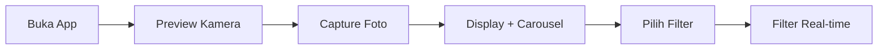

# 📸 Laporan Jobsheet 09 — Kamera di Flutter

<div align="center">


</div>

---

## 👤 Identitas Mahasiswa

| Atribut | Keterangan |
|---------|------------|
| **Nama** | Ahmad Fadlih Wahyu Sardana |
| **NIM** | 2341720069 |
| **Kelas** | TI-3F |
| **No. Absen** | 03 |
| **Mata Kuliah** | Pemrograman Mobile |

---

## 📋 Daftar Isi

- [📖 Ringkasan Praktikum](#-ringkasan-praktikum)
- [🎯 Praktikum 1: Mengambil Foto dengan Kamera](#-praktikum-1-mengambil-foto-dengan-kamera-di-flutter)
- [🎨 Praktikum 2: Membuat Photo Filter Carousel](#-praktikum-2-membuat-photo-filter-carousel)
- [📂 Daftar Project](#-daftar-project)
- [▶️ Cara Menjalankan](#️-cara-menjalankan)
- [📝 Tugas Praktikum](#-tugas-praktikum)
- [💡 Penjelasan Konsep](#-penjelasan-konsep-pemrograman)
- [📌 Catatan](#-catatan)

---

## 📖 Ringkasan Praktikum

Jobsheet ini membahas penggunaan **kamera di Flutter** untuk mengambil foto dan menerapkan filter secara real-time. Praktikum mencakup:

- ✅ Penggunaan plugin `camera` untuk akses kamera perangkat
- ✅ Menampilkan preview kamera dengan `CameraPreview`
- ✅ Capture dan menyimpan foto
- ✅ Membuat filter carousel interaktif dengan custom widgets
- ✅ Integrasi kamera dan filter dalam satu aplikasi

---

## 🎯 Praktikum 1: Mengambil Foto dengan Kamera di Flutter

### 📝 Langkah-langkah Implementasi

<details>
<summary><b>Langkah 1: Buat Project Baru</b></summary>

✅ Project `kamera_flutter` telah dibuat dengan struktur yang rapi.

```bash
flutter create kamera_flutter
```

</details>

<details>
<summary><b>Langkah 2: Tambah Dependensi yang Diperlukan</b></summary>

✅ Dependensi berikut telah ditambahkan ke `pubspec.yaml`:

```yaml
dependencies:
  camera: ^0.11.2+1        # Untuk akses kamera
  path_provider: ^2.1.5    # Untuk path penyimpanan
  path: ^1.9.1             # Untuk mendukung berbagai platform
```

**Konfigurasi Platform:**

- **Android**: `minSdkVersion` diset ke **21** pada `android/app/build.gradle.kts`
- **iOS**: Permission kamera dan mikrofon di `ios/Runner/Info.plist`

</details>

<details>
<summary><b>Langkah 3: Ambil Sensor Kamera dari Device</b></summary>

✅ File `lib/main.dart` diupdate dengan:

```dart
Future<void> main() async {
  WidgetsFlutterBinding.ensureInitialized();
  final cameras = await availableCameras();
  final firstCamera = cameras.first;
  
  runApp(MyApp(camera: firstCamera));
}
```

**Penjelasan:**
- `WidgetsFlutterBinding.ensureInitialized()` - Inisialisasi plugin sebelum runApp
- `availableCameras()` - Mendapatkan daftar kamera yang tersedia
- `async/await` - Menunggu hasil dari operasi asynchronous

</details>

<details>
<summary><b>Langkah 4: Buat dan Inisialisasi CameraController</b></summary>

✅ File `lib/widget/takepicture_screen.dart` dibuat:

```dart
class TakePictureScreen extends StatefulWidget {
  final CameraDescription camera;
  // ...
}

class _TakePictureScreenState extends State<TakePictureScreen> {
  late CameraController _controller;
  late Future<void> _initializeControllerFuture;
  
  @override
  void initState() {
    super.initState();
    _controller = CameraController(
      widget.camera,
      ResolutionPreset.medium,
    );
    _initializeControllerFuture = _controller.initialize();
  }
  
  @override
  void dispose() {
    _controller.dispose();
    super.dispose();
  }
}
```

</details>

<details>
<summary><b>Langkah 5: Gunakan CameraPreview untuk Menampilkan Preview</b></summary>

✅ Widget build menggunakan `FutureBuilder`:

```dart
FutureBuilder<void>(
  future: _initializeControllerFuture,
  builder: (context, snapshot) {
    if (snapshot.connectionState == ConnectionState.done) {
      return CameraPreview(_controller);
    } else {
      return const Center(child: CircularProgressIndicator());
    }
  },
)
```

</details>

<details>
<summary><b>Langkah 6: Ambil Foto dengan CameraController</b></summary>

✅ Ditambahkan `FloatingActionButton` untuk capture:

```dart
FloatingActionButton(
  onPressed: () async {
    try {
      await _initializeControllerFuture;
      final image = await _controller.takePicture();
      // Navigate to display screen
    } catch (e) {
      print(e);
    }
  },
  child: const Icon(Icons.camera_alt),
)
```

</details>

<details>
<summary><b>Langkah 7: Buat Widget DisplayPictureScreen</b></summary>

✅ File `lib/widget/displaypicture_screen.dart` dibuat:

```dart
class DisplayPictureScreen extends StatelessWidget {
  final String imagePath;
  
  const DisplayPictureScreen({required this.imagePath});
  
  @override
  Widget build(BuildContext context) {
    return Scaffold(
      appBar: AppBar(title: const Text('Display Picture')),
      body: Image.file(File(imagePath)),
    );
  }
}
```

</details>

<details>
<summary><b>Langkah 8 & 9: Implementasi Navigasi</b></summary>

✅ Navigasi ke DisplayPictureScreen setelah capture:

```dart
if (!context.mounted) return;
await Navigator.of(context).push(
  MaterialPageRoute(
    builder: (context) => DisplayPictureScreen(imagePath: image.path),
  ),
);
```

</details>

### ✅ Output Praktikum 1

Aplikasi kamera berhasil dibuat dengan fitur:

- ✅ Preview kamera real-time
- ✅ Tombol capture foto dengan ikon kamera
- ✅ Tampilan hasil foto yang diambil
- ✅ Navigasi antar screen
- ✅ Error handling yang proper

---

## 🎨 Praktikum 2: Membuat Photo Filter Carousel

### 📝 Langkah-langkah Implementasi

<details>
<summary><b>Langkah 1: Buat Project Photo Filter Carousel</b></summary>

✅ Project `photo_filter_carousel` telah dibuat dengan struktur yang rapi.

```bash
flutter create photo_filter_carousel
```

</details>

<details>
<summary><b>Langkah 2: Buat Widget Selector Ring dan Dark Gradient</b></summary>

✅ File `lib/widget/filter_selector.dart` dibuat dengan:

**Komponen Utama:**
- `PageController` untuk navigasi carousel
- `onFilterChanged` callback untuk notifikasi perubahan filter
- `_buildShadowGradient()` untuk gradient gelap
- `_buildCarousel()` untuk layout filter carousel
- `_buildSelectionRing()` untuk ring seleksi putih
- Pagination dengan **5 filter per screen**

```dart
PageController(
  initialPage: _page,
  viewportFraction: 1.0 / 5, // 5 items per screen
);
```

</details>

<details>
<summary><b>Langkah 3: Buat Widget Photo Filter Carousel</b></summary>

✅ File `lib/widget/filter_carousel.dart` dibuat dengan:

```dart
class PhotoFilterCarousel extends StatefulWidget {
  final _filters = [
    Colors.white,
    ...List.generate(
      Colors.primaries.length,
      (index) => Colors.primaries[(index * 4) % Colors.primaries.length],
    ),
  ];
  
  final _filterColor = ValueNotifier<Color>(Colors.white);
  
  // Stack layout: photo + filter selector
}
```

**Fitur:**
- List warna dari `Colors.primaries`
- `ValueNotifier` untuk reactive updates
- Stack layout untuk overlay filter selector

</details>

<details>
<summary><b>Langkah 4: Membuat Filter Warna dengan FlowDelegate</b></summary>

✅ File `lib/widget/carousel_flowdelegate.dart` dibuat:

```dart
class CarouselFlowDelegate extends FlowDelegate {
  // Transform calculations
  final itemScale = 0.5 + (percentFromCenter * 0.5);
  final opacity = 0.25 + (percentFromCenter * 0.75);
  
  // Matrix4 transform
  final itemTransform = Matrix4.identity()
    ..translate(/* position */)
    ..multiply(Matrix4.diagonal3Values(itemScale, itemScale, 1.0));
}
```

**Efek Visual:**
- **Scale**: Item tengah lebih besar (0.5 - 1.0)
- **Opacity**: Item tengah lebih jelas (0.25 - 1.0)
- Smooth transition saat scroll

</details>

<details>
<summary><b>Langkah 5: Buat Widget Filter Item</b></summary>

✅ File `lib/widget/filter_item.dart` dibuat:

```dart
@immutable
class FilterItem extends StatelessWidget {
  final Color color;
  final VoidCallback? onFilterSelected;
  
  Widget build(BuildContext context) {
    return GestureDetector(
      onTap: onFilterSelected,
      child: ClipOval(
        child: Image.network(
          /* image url */,
          color: color.withOpacity(0.5),
          colorBlendMode: BlendMode.hardLight,
        ),
      ),
    );
  }
}
```

</details>

<details>
<summary><b>Langkah 6: Implementasi di Main</b></summary>

✅ File `main.dart` diupdate:

```dart
void main() {
  runApp(const MaterialApp(
    home: PhotoFilterCarousel(),
    debugShowCheckedModeBanner: false,
  ));
}
```

</details>

### ✅ Output Praktikum 2

Aplikasi photo filter carousel berhasil dibuat dengan fitur:

- ✅ Carousel filter warna yang dapat di-scroll
- ✅ Preview foto dengan filter real-time
- ✅ Animasi smooth saat pindah filter
- ✅ Scale & opacity effect pada carousel
- ✅ Ring seleksi putih pada filter aktif
- ✅ Gradient shadow di bagian bawah
- ✅ Responsive layout dengan Flow widget

### 🛠️ Teknologi yang Digunakan

| Teknologi | Fungsi |
|-----------|--------|
| `PageController` | Pagination carousel |
| `ValueNotifier` | Reactive state management |
| `FlowDelegate` | Custom layout positioning |
| `Matrix4` | Transform calculations |
| `ColorBlendMode` | Image color filtering |
| `ViewportOffset` | Scroll position tracking |

---

## 📂 Daftar Project

Jobsheet ini terdiri dari **3 project terpisah** dengan tujuan yang berbeda:

### 1. 📷 Kamera Flutter (`kamera_flutter/`)

**Praktikum 1 - Aplikasi Kamera Murni**

Project ini adalah implementasi **Praktikum 1** dalam bentuk murni, tanpa fitur tambahan. Fokus pada pembelajaran dasar penggunaan kamera di Flutter.

**✨ Fitur:**
- ✅ Mengakses kamera perangkat
- ✅ Menampilkan preview kamera dengan `CameraPreview`
- ✅ Mengambil foto menggunakan `CameraController`
- ✅ Menyimpan foto ke storage lokal
- ✅ Menampilkan foto hasil capture (tanpa filter)

**🎯 Tujuan:**
- Pembelajaran dasar plugin `camera`
- Memahami lifecycle `CameraController`
- Praktik async/await dengan `Future`
- Manajemen path dengan `path_provider`

**📌 Catatan:** Project ini **TIDAK** memiliki fitur filter. Untuk fitur filter, lihat project `photo_filter_carousel` atau `camera_filter_app`.

---

### 2. 🎨 Photo Filter Carousel (`photo_filter_carousel/`)

**Praktikum 2 - Filter Carousel Standalone**

Project ini adalah implementasi **Praktikum 2** yang fokus pada pembuatan filter carousel interaktif menggunakan custom widgets dan animations.

**✨ Fitur:**
- ✅ Carousel filter warna yang dapat di-scroll
- ✅ Preview foto dengan filter real-time
- ✅ Animasi smooth saat pindah filter
- ✅ Scale & opacity effect pada carousel
- ✅ Ring seleksi putih pada filter aktif
- ✅ Gradient shadow di bagian bawah
- ✅ Responsive layout dengan Flow widget

**🛠️ Teknologi:**
- `PageController` - Pagination carousel
- `ValueNotifier` - Reactive state management
- `FlowDelegate` - Custom layout positioning
- `Matrix4` - Transform calculations
- `ColorBlendMode` - Image color filtering

**📌 Catatan:** Project ini **TIDAK** memiliki fitur kamera. Foto yang digunakan adalah gambar statis dari assets.

---

### 3. 📸 Camera Filter App (`camera_filter_app/`)

**Integrasi Praktikum 1 + 2 - Aplikasi Lengkap**

Project ini adalah hasil **penggabungan Praktikum 1 dan 2**, menggabungkan fitur kamera dan filter carousel dalam satu aplikasi yang utuh.

**✨ Fitur Lengkap:**
- ✅ Mengambil foto dengan kamera (dari Praktikum 1)
- ✅ Filter carousel interaktif (dari Praktikum 2)
- ✅ Preview foto hasil capture dengan filter real-time
- ✅ Smooth transitions dan animations
- ✅ Menyimpan foto dengan filter yang dipilih

**🔄 Alur Aplikasi:**
1. User membuka aplikasi → Tampil preview kamera
2. User menekan tombol capture → Foto tersimpan
3. Navigasi ke halaman display → Foto ditampilkan
4. User dapat memilih filter dari carousel → Filter diterapkan real-time
5. Foto dapat disimpan dengan filter yang dipilih

**🎯 Keunggulan:**
- Gabungan fitur kamera + filter dalam satu workflow
- User experience yang seamless
- Implementasi penuh dari kedua praktikum
- Cocok untuk portfolio atau demo

---

### 📊 Perbandingan Project

| Aspek | `kamera_flutter` | `photo_filter_carousel` | `camera_filter_app` |
|-------|------------------|------------------------|---------------------|
| **Tujuan** | Praktikum 1 (Kamera) | Praktikum 2 (Filter) | Integrasi Lengkap |
| **Fitur Kamera** | ✅ | ❌ | ✅ |
| **Fitur Filter** | ❌ | ✅ | ✅ |
| **Sumber Foto** | Capture dari kamera | Assets statis | Capture dari kamera |
| **Complexity** | 🟢 Basic | 🟡 Medium | 🔴 Advanced |
| **Praktikum** | Praktikum 1 only | Praktikum 2 only | Praktikum 1 + 2 |
| **Status** | ✅ Selesai | ✅ Selesai | ✅ Selesai |

---

### 💡 Rekomendasi Penggunaan

| Kebutuhan | Project yang Disarankan |
|-----------|------------------------|
| Belajar dasar kamera | `kamera_flutter` |
| Belajar custom widgets & animations | `photo_filter_carousel` |
| Implementasi lengkap untuk portfolio | `camera_filter_app` |
| Memahami integrasi multi-fitur | `camera_filter_app` |
| Demo sederhana filter carousel | `photo_filter_carousel` |

---

## ▶️ Cara Menjalankan

### 📷 Kamera Flutter (Praktikum 1 - Kamera Murni)

```bash
# Masuk ke folder project
cd kamera_flutter

# Install dependencies
flutter pub get

# Jalankan aplikasi
flutter run
```

> **⚠️ Catatan**: Gunakan **physical device** atau emulator dengan dukungan kamera.

---

### 🎨 Photo Filter Carousel (Praktikum 2 - Filter Only)

```bash
# Masuk ke folder project
cd photo_filter_carousel

# Install dependencies
flutter pub get

# Jalankan aplikasi (Android/iOS/Desktop)
flutter run

# Atau jalankan di web browser
flutter run -d chrome
```

> **💡 Tips**: Project ini bisa dijalankan di **semua platform** termasuk web browser karena tidak memerlukan akses kamera.

---

### 📸 Camera Filter App (Integrasi Penuh)

```bash
# Masuk ke folder project
cd camera_filter_app

# Install dependencies
flutter pub get

# Jalankan aplikasi (HARUS physical device atau emulator)
flutter run
```

> **⚠️ Important**: 
> - Aplikasi ini **memerlukan physical device atau emulator** untuk fitur kamera
> - Jika dijalankan di web browser, akan menampilkan fallback UI (kamera tidak didukung)
> - `Image.file()` tidak support di web platform

---

## 🌐 Web Support & Limitations

### ✅ Fully Supported on Web

**Photo Filter Carousel** (`photo_filter_carousel/`)
- ✅ Filter carousel berfungsi penuh
- ✅ Image loading dari network dengan error handling
- ✅ Semua animasi dan interaksi berfungsi
- ✅ Cocok untuk demo di web browser

```bash
cd photo_filter_carousel
flutter run -d chrome
```

### ⚠️ Limited Support on Web

**Kamera Flutter & Camera Filter App**
- ❌ Fitur kamera **tidak didukung** di web
- ✅ Menampilkan **fallback UI** dengan pesan informatif
- ✅ Tidak crash, hanya menampilkan pesan "gunakan physical device"
- 📱 **Harus menggunakan physical device atau emulator**

**Alasan Keterbatasan:**
- `Image.file()` tidak support di Flutter Web
- Plugin `camera` memiliki keterbatasan di web platform
- File system access berbeda antara web dan mobile

**Solusi yang Diterapkan:**
```dart
// Deteksi platform web
if (kIsWeb) {
  // Tampilkan fallback UI
  return Center(
    child: Text('Fitur kamera tidak didukung di web'),
  );
} else {
  // Normal behavior di Android/iOS
  return Image.file(File(imagePath));
}
```

---

## 📝 Tugas Praktikum

### 🎯 1. Implementasi 3 Project Terpisah

Jobsheet ini telah diimplementasikan dalam **3 project terpisah** dengan tujuan pembelajaran yang berbeda:

1. **`kamera_flutter`** - Praktikum 1 (Kamera murni tanpa filter)
2. **`photo_filter_carousel`** - Praktikum 2 (Filter carousel tanpa kamera)
3. **`camera_filter_app`** - Integrasi Praktikum 1 + 2 (Kamera + Filter)

---

### 📸 A. Screenshot Kamera Flutter (Praktikum 1)

**Project:** `kamera_flutter/` - Aplikasi kamera murni **tanpa fitur filter**

#### 📷 1. Camera Preview Screen


*Preview kamera dengan tombol capture di tengah bawah*

#### 📸 2. Photo Display Screen


*Foto hasil capture ditampilkan tanpa filter carousel*

**📌 Catatan:** Project ini **TIDAK** memiliki filter carousel. Hanya menampilkan foto hasil capture murni sesuai Praktikum 1.

---

### 🎨 B. Screenshot Photo Filter Carousel (Praktikum 2)

**Project:** `photo_filter_carousel/` - Filter carousel **tanpa fitur kamera**

#### ⚪ 1. Filter Putih (Default)


*Foto dengan filter putih (tanpa efek warna)*

#### � 2. Filter Berwarna


*Foto dengan filter berwarna (biru/merah/hijau) diterapkan*

#### 🎠 3. Carousel Detail


*Detail carousel dengan ring seleksi, scale effect, dan gradient shadow*

**📌 Catatan:** Project ini menggunakan **foto statis dari assets**, bukan dari kamera.

---

### � C. Screenshot Camera Filter App (Integrasi Lengkap)

**Project:** `camera_filter_app/` - Gabungan Praktikum 1 + 2

#### 🔄 Alur Aplikasi Terintegrasi



**Step-by-step:**

1. 📱 **Buka aplikasi** → Preview kamera (seperti Praktikum 1)
2. 📷 **Tekan tombol capture** → Foto diambil dan disimpan
3. ➡️ **Navigasi otomatis** → DisplayPictureScreen dengan filter carousel
4. 🎨 **Scroll carousel** → Filter diterapkan real-time pada foto hasil capture
5. 👆 **Tap filter** → Animasi smooth ke filter yang dipilih

#### � 1. Camera Preview


*Preview kamera sebelum mengambil foto*

#### 📸 2. Photo Capture Process


*Proses mengambil foto dengan tombol capture*

#### ⚪ 3. Display dengan Filter Putih


*Foto hasil capture dengan filter putih (default) dan carousel di bawah*

#### 🔴 4. Display dengan Filter Warna


*Foto hasil capture dengan filter warna diterapkan real-time*

#### 🎯 5. Carousel Detail


*Close-up carousel menampilkan preview foto hasil capture di setiap filter item*

---

### 🛠️ Implementasi Teknis (Camera Filter App)

**File Structure:**

```
camera_filter_app/lib/
├── main.dart                      # Entry point dengan availableCameras()
├── src/
│   └── identity.dart              # Konstanta identitas
└── widget/
    ├── takepicture_screen.dart    # Camera preview & capture (dari Praktikum 1)
    ├── displaypicture_screen.dart # Display foto dengan filter integration
    ├── filter_selector.dart       # Carousel PageController (dari Praktikum 2)
    ├── carousel_flowdelegate.dart # Custom FlowDelegate (dari Praktikum 2)
    └── filter_item.dart           # Filter item widget (dari Praktikum 2)
```

**Key Implementation:**

```dart
// DisplayPictureScreen - Integrasi kamera + filter
Stack(
  children: [
    // Foto hasil capture dari kamera
    Positioned.fill(
      child: Image.file(
        File(imagePath),
        color: filterColor.withOpacity(0.5),
        colorBlendMode: BlendMode.color,
      ),
    ),
    // Filter carousel di bawah
    Positioned(
      bottom: 0,
      left: 0,
      right: 0,
      child: FilterSelector(
        filters: _filters,
        onFilterChanged: (color) => _filterColor.value = color,
        imagePath: imagePath, // ← Pass foto hasil capture ke carousel
      ),
    ),
  ],
)
```

**Perbedaan dengan Praktikum 1 & 2:**

| Aspek | Praktikum 1 | Praktikum 2 | Camera Filter App |
|-------|-------------|-------------|-------------------|
| Sumber Foto | Kamera | Assets statis | **Kamera** |
| Filter Carousel | ❌ Tidak ada | ✅ Ada | ✅ Ada |
| Filter Items | - | Assets statis | **Foto dari kamera** |
| DisplayPictureScreen | StatelessWidget | - | **StatefulWidget** |

---

### 📂 Panduan Screenshot

Untuk panduan lengkap mengambil screenshot semua project, lihat:

**👉 [Screenshot Guide](img/SCREENSHOT_GUIDE.md)**

Panduan mencakup:
- ✅ Struktur folder screenshot untuk 3 project
- ✅ Cara mengambil screenshot di Android/iOS/DevTools
- ✅ Checklist lengkap (11-12 screenshots)
- ✅ Git workflow untuk upload
- ✅ Tips & troubleshooting

> 📌 **Status:** Screenshot akan ditambahkan setelah running aplikasi di device/emulator

---

### 🛡️ Error Handling & Web Support

#### 1. **Image Loading Error (Photo Filter Carousel)**

**Masalah Awal:**
```
NetworkImageLoadException: HTTP request failed, statusCode: 404
URL: https://docs.flutter.dev/cookbook/img-files/effects/.../millennial-dude.jpg
```

**Solusi yang Diterapkan:**

```dart
Image.network(
  'https://picsum.photos/200',  // URL reliable
  errorBuilder: (context, error, stackTrace) {
    // Fallback UI jika gagal load
    return Container(
      color: color,
      child: const Center(
        child: Icon(Icons.photo, color: Colors.white54, size: 40),
      ),
    );
  },
  loadingBuilder: (context, child, loadingProgress) {
    // Loading indicator
    if (loadingProgress == null) return child;
    return Center(child: CircularProgressIndicator());
  },
)
```

**Hasil:**
- ✅ Tidak ada lagi error 404
- ✅ Menampilkan loading indicator saat gambar dimuat
- ✅ Fallback ke icon jika gagal load

---

#### 2. **Web Platform Support (Kamera Flutter & Camera Filter App)**

**Masalah Awal:**
```
Assertion failed: Image.file is not supported on Flutter Web.
Consider using either Image.asset or Image.network instead.
```

**Solusi yang Diterapkan:**

```dart
import 'package:flutter/foundation.dart' show kIsWeb;

Widget build(BuildContext context) {
  return kIsWeb
    ? Center(  // Fallback untuk web
        child: Column(
          children: [
            Icon(Icons.web, size: 100),
            Text('Fitur kamera tidak didukung di Web'),
            Text('Gunakan physical device atau emulator'),
          ],
        ),
      )
    : Image.file(File(imagePath));  // Normal di Android/iOS
}
```

**Implementasi di 3 File:**
1. `kamera_flutter/lib/widget/displaypicture_screen.dart`
2. `camera_filter_app/lib/widget/displaypicture_screen.dart`
3. `camera_filter_app/lib/widget/filter_item.dart`

**Hasil:**
- ✅ Tidak ada error di web browser
- ✅ Menampilkan pesan informatif
- ✅ Aplikasi tetap berfungsi normal di Android/iOS
- ✅ User experience lebih baik

---

#### 3. **Platform Detection Best Practice**

**Konsep `kIsWeb`:**

```dart
import 'package:flutter/foundation.dart' show kIsWeb;

// Conditional rendering berdasarkan platform
if (kIsWeb) {
  // Code untuk web
} else {
  // Code untuk mobile/desktop
}
```

**Kegunaan:**
- 📱 Deteksi apakah app berjalan di web browser
- 🔄 Conditional rendering untuk UI berbeda per platform
- ✅ Error prevention untuk fitur yang tidak support di web
- 🎯 Better user experience dengan fallback UI

---


## 💡 Penjelasan Konsep Pemrograman

### ❓ A. Maksud `void async` pada Praktikum 1

<details>
<summary><b>📖 Klik untuk melihat penjelasan lengkap</b></summary>

<br>

**Pertanyaan:** *Jelaskan maksud void async pada praktikum 1?*

#### 🔍 Jawaban

`void async` sebenarnya adalah **kombinasi dua hal terpisah**:

| Komponen | Penjelasan |
|----------|------------|
| `void` | Return type dari fungsi (tidak mengembalikan nilai) |
| `async` | Modifier yang menandakan fungsi berjalan secara asynchronous |

#### 📝  Detail Penjelasan

```dart
// Contoh dari main.dart Praktikum 1
Future<void> main() async {
  WidgetsFlutterBinding.ensureInitialized();
  final cameras = await availableCameras(); // ← await membutuhkan async
  final firstCamera = cameras.first;
  
  runApp(MyApp(camera: firstCamera));
}
```

#### ❓ Mengapa perlu `async`?

1. Fungsi `main()` perlu memanggil `await availableCameras()`
2. `await` **hanya bisa digunakan** di dalam fungsi yang ditandai `async`
3. `availableCameras()` adalah operasi I/O yang membutuhkan waktu (mengakses hardware kamera)

#### ❓ Mengapa `Future<void>` bukan hanya `void`?

- Ketika fungsi ditandai `async`, return type-nya **otomatis menjadi `Future`**
- `Future<void>` artinya: fungsi ini asynchronous dan tidak mengembalikan nilai (`void`)
- Tanpa `async`, cukup `void main()` saja

#### 📊 Perbandingan

```dart
// ❌ Synchronous (tanpa async) - Langsung selesai
void cetakNama() {
  print('Ahmad Fadlih');
}

// ✅ Asynchronous (dengan async) - Menunggu operasi selesai
Future<void> ambilDataDariServer() async {
  await Future.delayed(Duration(seconds: 2)); // Tunggu 2 detik
  print('Data berhasil diambil');
}
```

#### ✅ Kesimpulan

> `async` diperlukan ketika fungsi perlu **menunggu operasi yang memakan waktu** (seperti akses kamera, file, network) menggunakan `await`. Return type otomatis menjadi `Future<T>` dimana `T` adalah tipe nilai yang dikembalikan (`void` jika tidak mengembalikan apa-apa).

</details>

---

### ❓ B. Fungsi Anotasi `@immutable` dan `@override`

<details>
<summary><b>📖 Klik untuk melihat penjelasan lengkap</b></summary>

<br>

**Pertanyaan:** *Jelaskan fungsi dari anotasi @immutable dan @override?*

#### 🔒 1. Anotasi `@immutable`

**Definisi:**

> Anotasi yang menandakan bahwa **semua field di dalam class harus bersifat final** (tidak bisa diubah setelah object dibuat).

**✅ Fungsi:**

| Fungsi | Keterangan |
|--------|------------|
| 🔒 **Immutability** | Memastikan widget bersifat immutable (tidak berubah) |
| ⚡ **Performance** | Meningkatkan performa Flutter dengan rebuilding yang efisien |
| 🐛 **Bug Prevention** | Mencegah bugs akibat perubahan state yang tidak terduga |
| ⚠️ **Warning** | Memberikan warning jika ada field non-final |

**💻 Contoh Penggunaan:**

```dart
@immutable
class FilterItem extends StatelessWidget {
  final Color color;                    // ✅ HARUS final
  final VoidCallback? onFilterSelected; // ✅ HARUS final
  
  const FilterItem({super.key, required this.color, this.onFilterSelected});
  
  @override
  Widget build(BuildContext context) {
    // ...
  }
}
```

**🎯 Mengapa Penting di Flutter?**

Flutter menggunakan konsep **declarative UI** dimana widget adalah blueprint, bukan instance yang berubah-ubah.

```
Widget Immutable → Flutter Compare Efisien → Hanya Rebuild yang Berubah → Performance ⚡
```

**❌ Contoh Kasus Salah:**

```dart
@immutable
class BadWidget extends StatelessWidget {
  int counter = 0; // ❌ ERROR: Field harus final!
  
  // Lint warning: "All instance fields in an immutable class must be final"
}
```

**✅ Best Practice:**

- Gunakan `@immutable` untuk semua **StatelessWidget**
- Gunakan `@immutable` untuk custom widget yang tidak berubah
- Untuk data yang berubah, gunakan **StatefulWidget** atau **state management**

---

#### 🔄 2. Anotasi `@override`

**Definisi:**

> Anotasi yang menandakan bahwa method ini **meng-override (menimpa) method dari parent class atau interface**.

**✅ Fungsi:**

| Fungsi | Keterangan |
|--------|------------|
| 📝 **Dokumentasi** | Dokumentasi eksplisit bahwa method ini override parent |
| ✅ **Compile Check** | Error jika method yang di-override tidak ada di parent |
| 🔍 **Typo Prevention** | Warning jika nama method salah ketik |
| 📖 **Readability** | Programmer tahu ini override, bukan method baru |

**💻 Contoh Penggunaan:**

```dart
class FilterItem extends StatelessWidget {
  @override
  Widget build(BuildContext context) { // ← Override dari StatelessWidget
    // ...
  }
}

class _FilterSelectorState extends State<FilterSelector> {
  @override
  void initState() { // ← Override dari State
    super.initState();
    _controller = PageController(/* ... */);
  }
  
  @override
  void dispose() { // ← Override dari State
    _controller.dispose();
    super.dispose();
  }
  
  @override
  Widget build(BuildContext context) { // ← Override dari State
    // ...
  }
}
```

**🎯 Mengapa Penting?**

##### 1. ✅ Deteksi Error Lebih Cepat

```dart
class MyWidget extends StatelessWidget {
  @override
  Widget biuld(BuildContext context) { // ← Typo: 'biuld' bukan 'build'
    // ...
  }
}
// ❌ ERROR: Method 'biuld' doesn't override an inherited method
```

> Tanpa `@override`, kode akan compile tapi method `build()` **tidak pernah dipanggil** (bug tersembunyi!).

##### 2. 📝 Dokumentasi yang Jelas

```dart
@override
void initState() {
  super.initState(); // ← Jelas ini override, jadi kita tahu harus panggil super
  // custom initialization
}
```

##### 3. 🔧 Refactoring Safety

> Jika parent class mengubah signature method, kode dengan `@override` akan **error** (bagus, kita tahu harus update). Tanpa `@override`, kode compile tapi method tidak pernah dipanggil (bug!).

**✅ Best Practice:**

- **SELALU gunakan `@override`** ketika override method
- Dart analyzer akan memberikan **warning** jika lupa `@override`
- Modern IDE (VS Code, Android Studio) **auto-generate** `@override`

</details>

---

## 📊 Kesimpulan

### ✅ Pencapaian

| No | Item | Status |
|----|------|--------|
| 1 | Praktikum 1 (Kamera) selesai | ✅ `kamera_flutter` |
| 2 | Praktikum 2 (Filter) selesai | ✅ `photo_filter_carousel` |
| 3 | Integrasi Praktikum 1+2 selesai | ✅ `camera_filter_app` |
| 4 | Konsep `async` dipahami | ✅ Selesai |
| 5 | Konsep `@immutable` dipahami | ✅ Selesai |
| 6 | Konsep `@override` dipahami | ✅ Selesai |
| 7 | Dokumentasi lengkap | ✅ Selesai |
| 8 | Screenshot guide tersedia | ✅ Selesai |

### 🎯 Ringkasan Teknis

#### Struktur 3 Project Terpisah

**1. `kamera_flutter/` - Praktikum 1 Murni**
- ✅ Implementasi kamera menggunakan plugin `camera`
- ✅ Preview kamera dengan `CameraPreview`
- ✅ Capture dan simpan foto
- ✅ Display foto tanpa filter
- ❌ TIDAK memiliki filter carousel (sesuai Praktikum 1)

**2. `photo_filter_carousel/` - Praktikum 2 Murni**
- ✅ Filter carousel dengan `PageController`
- ✅ Custom `FlowDelegate` untuk layout
- ✅ Filter real-time dengan `ColorBlendMode`
- ✅ Animasi smooth dengan scale & opacity
- ❌ TIDAK memiliki fitur kamera (foto dari assets)

**3. `camera_filter_app/` - Integrasi Lengkap**
- ✅ Gabungan Praktikum 1 + 2
- ✅ Kamera capture + Filter carousel
- ✅ Foto dari kamera diterapkan filter real-time
- ✅ User experience yang seamless

### 📚 Konsep yang Dipahami

| Konsep | Penjelasan Singkat |
|--------|-------------------|
| **`async/await`** | Operasi asynchronous untuk akses kamera |
| **`@immutable`** | Widget tidak berubah, field harus final |
| **`@override`** | Override method parent, deteksi error |
| **`CameraController`** | Kontrol kamera (initialize, capture, dispose) |
| **`PageController`** | Navigasi carousel dengan pagination |
| **`ValueNotifier`** | Reactive state management untuk filter |
| **`FlowDelegate`** | Custom layout dengan transformasi |
| **`ColorBlendMode`** | Blending warna untuk efek filter |
| **`kIsWeb`** | Deteksi platform untuk conditional rendering |
| **`errorBuilder`** | Error handling untuk Image.network |
| **`loadingBuilder`** | Loading state untuk asynchronous image |

### 🔗 Informasi Repository

| Item | Keterangan |
|------|------------|
| **Repository** | [github.com/afadlih/Pemrograman-Mobile](https://github.com/afadlih/Pemrograman-Mobile) |
| **Branch** | `main` |
| **Folder Praktikum 1** | `codelab09/kamera_flutter/` |
| **Folder Praktikum 2** | `codelab09/photo_filter_carousel/` |
| **Folder Integrasi** | `codelab09/camera_filter_app/` |
| **Dokumentasi** | `codelab09/README.md` |
| **Screenshot Guide** | `codelab09/img/SCREENSHOT_GUIDE.md` |

---

## 📌 Catatan

### ⚠️ Penting

- Plugin `camera` memerlukan **permission akses kamera** pada Android dan iOS
- Pastikan menggunakan **perangkat fisik** untuk testing fitur kamera secara optimal
- `kamera_flutter` dan `camera_filter_app` memerlukan physical device dengan kamera
- `photo_filter_carousel` dapat dijalankan di emulator dan web browser
- Gambar hasil capture disimpan di **storage aplikasi**
- **Web Support**: Kamera tidak didukung di web browser (akan menampilkan fallback UI)

### 💡 Tips

- Gunakan `flutter doctor` untuk memastikan environment sudah siap
- Untuk debug, gunakan `flutter run -v` untuk verbose output
- Hot reload dengan `r` dan hot restart dengan `R` saat development
- Untuk testing kamera, gunakan physical device untuk hasil optimal
- Screenshot dapat diambil menggunakan Flutter DevTools
- **Testing di Web**: Hanya `photo_filter_carousel` yang fully functional di web

### 🆘 Troubleshooting

| Masalah | Solusi |
|---------|--------|
| Camera tidak muncul | Pastikan permission sudah diberikan di settings |
| Error build Android | Check `minSdkVersion` minimal 21 di `build.gradle.kts` |
| Error iOS | Pastikan `Info.plist` sudah ada camera permission |
| Image 404 error (`photo_filter_carousel`) | Sudah fixed - menggunakan picsum.photos dengan fallback |
| Image.file error di web | Sudah fixed - ada fallback UI dengan pesan informatif |
| Import error setelah create project | Jalankan `flutter pub get` terlebih dahulu |
| Build failed di `camera_filter_app` | Pastikan semua dependencies sudah terinstall |
| Web browser menampilkan pesan "tidak didukung" | Normal - fitur kamera tidak support di web, gunakan device |

### � Dependencies

**Kamera Flutter & Camera Filter App:**
```yaml
dependencies:
  camera: ^0.11.2+1
  path_provider: ^2.1.5
  path: ^1.9.1
```

**Photo Filter Carousel:**
```yaml
# Hanya menggunakan Flutter SDK (no external packages)
```

### 🏗️ Platform Requirements

| Platform | Requirement | Support |
|----------|-------------|---------|
| **Android** | minSdkVersion 21 | ✅ Full Support |
| **iOS** | iOS 11.0+ with camera permissions | ✅ Full Support |
| **Web** | Modern browser (Chrome, Edge, Firefox) | ⚠️ Limited (no camera) |
| **Desktop** | Windows/macOS/Linux | ⚠️ Camera support varies |

#### 📝 Platform Notes

**Web Browser:**
- ✅ `photo_filter_carousel` - Fully functional
- ⚠️ `kamera_flutter` - Menampilkan fallback UI (kamera tidak didukung)
- ⚠️ `camera_filter_app` - Menampilkan fallback UI (kamera tidak didukung)
- `Image.file()` tidak support di web, diganti dengan pesan informatif

**Mobile (Android/iOS):**
- ✅ Semua fitur berfungsi dengan baik
- Memerlukan permission akses kamera
- Recommended untuk screenshot dan demo

**Desktop:**
- ⚠️ Support kamera bervariasi tergantung OS dan hardware
- Lebih baik test di mobile device

---

### 📱 Informasi Tambahan

**Politeknik Negeri Malang**  
**Jurusan Teknologi Informasi**  
**Program Studi D-IV Teknik Informatika**

Dokumentasi ini dibuat dengan ❤️ oleh **Ahmad Fadlih Wahyu Sardana**  
NIM: 2341720069 | Kelas: TI-3F

