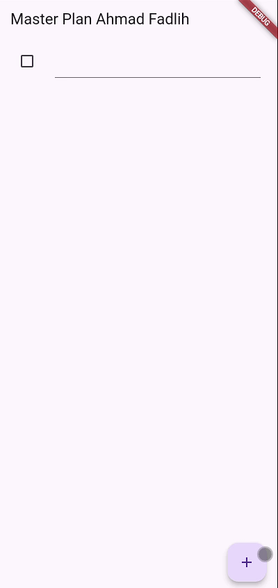
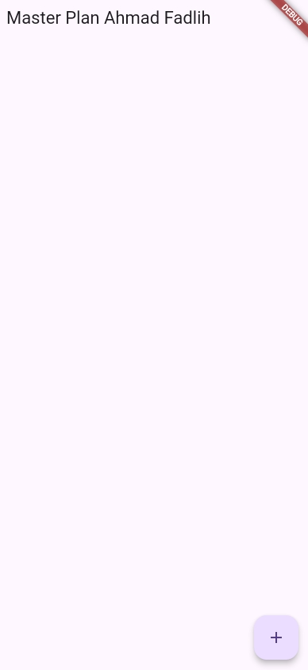
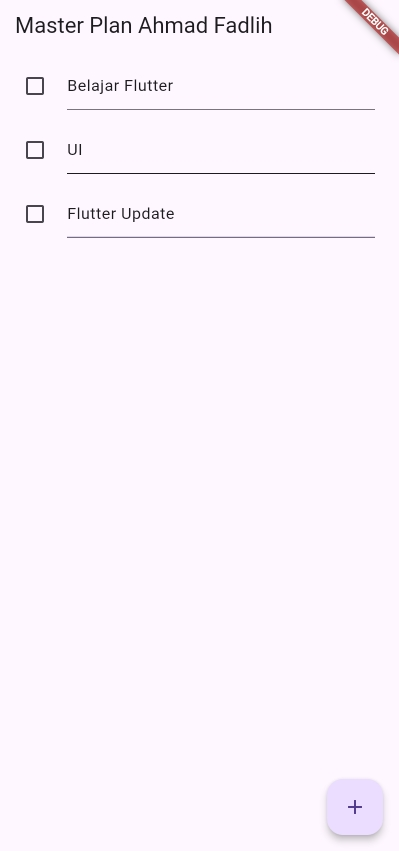
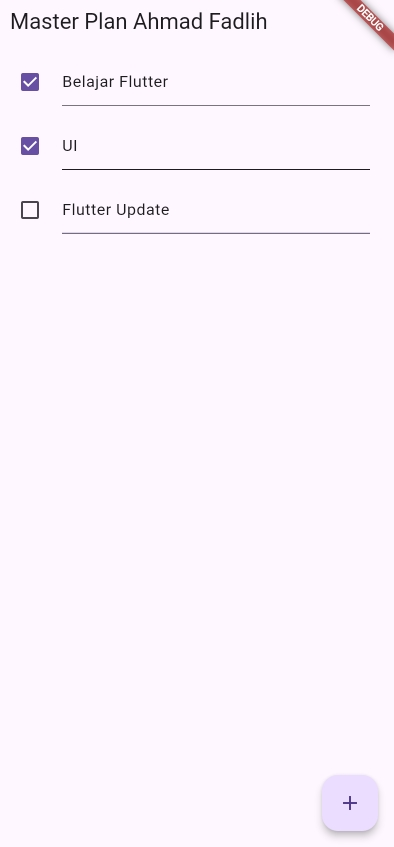
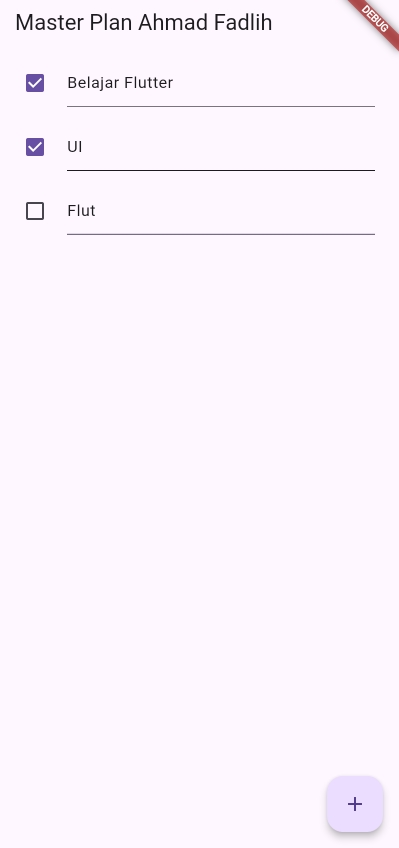
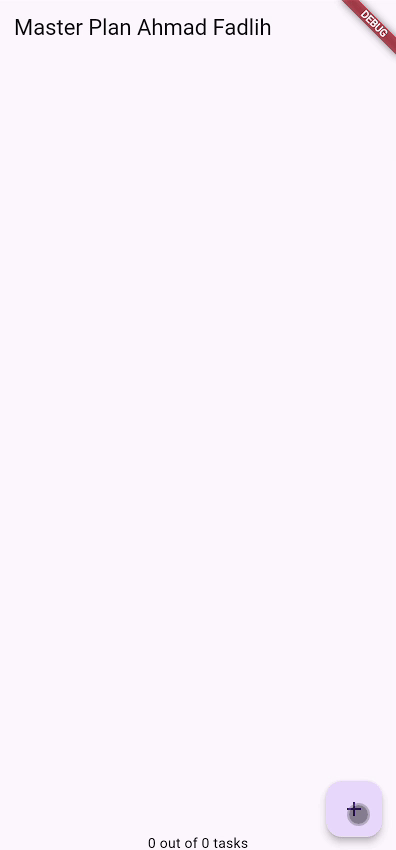

# Codelab 10: Dasar State Management

## Informasi Mahasiswa
- **Nama**: Ahmad Fadlih
- **NIM**: 2341720069
- **Kelas**: TI-3F / 03

---

## Praktikum 1: Dasar State dengan Model-View

### Tujuan Praktikum
Praktikum ini bertujuan untuk memahami konsep dasar state management dalam Flutter menggunakan pola Model-View.akan membuat aplikasi Master Plan sederhana untuk mengelola daftar tugas (to-do list).

---

### 📸 Screenshot Praktikum 1
**Status**: ✅ 5 dari 6 screenshot tersedia (83% selesai)

Screenshot aplikasi tersedia di folder `img/`:
- ✅ `app_empty.jpeg` - Tampilan aplikasi kosong
- ✅ `app_adding_task.jpeg` - Proses menambah tugas
- ✅ `app_with_checkbox.jpeg` - Tampilan dengan checkbox
- ✅ `app_editting.jpeg` - Proses edit tugas
- ✅ `langkah9_demo.gif` - Demo interaksi langkah 9
- ⏳ `praktikum1_demo.gif` - Demo komprehensif (pending)

> Lihat detail screenshot di [SCREENSHOT_GUIDE.md](img/SCREENSHOT_GUIDE.md)

---

**Penjelasan Aplikasi:**
Aplikasi Master Plan yang telah dibuat merupakan aplikasi manajemen tugas sederhana dengan fitur-fitur berikut:
1. **Menambah Tugas**: Menggunakan tombol FloatingActionButton (+) di pojok kanan bawah
2. **Menandai Tugas Selesai**: Checkbox di sebelah kiri setiap tugas untuk menandai status penyelesaian
3. **Mengedit Deskripsi Tugas**: TextFormField yang dapat langsung diedit untuk mengubah nama tugas
4. **Keyboard Dismiss**: Keyboard otomatis tertutup saat scroll di platform iOS

---

### Jawaban Soal Praktikum

#### Soal 1: Dokumentasi dan Hasil Akhir
Langkah-langkah praktikum telah diselesaikan . Struktur project yang telah dibuat:

```
lib/
├── models/
│   ├── task.dart          # Model untuk Task
│   ├── plan.dart          # Model untuk Plan
│   └── data_layer.dart    # Export file untuk models
├── views/
│   └── plan_screen.dart   # UI Screen utama
└── main.dart              # Entry point aplikasi
```


---

#### Soal 2: Penjelasan Langkah 4

**Langkah 4** membuat file `data_layer.dart` yang berisi:
```dart
export 'plan.dart';
export 'task.dart';
```

**Maksud dan Tujuan:**
- **Centralized Import**: File ini berfungsi sebagai **barrel file** atau **index file** yang mengumpulkan semua export dari model-model dalam satu tempat
- **Simplifikasi Import**: Daripada mengimport setiap file model secara terpisah,  cukup import satu file `data_layer.dart`
- **Maintainability**: Memudahkan maintenance kode, jika ada penambahan model baru, cukup tambahkan export di file ini

**Contoh:**

Tanpa `data_layer.dart`:
```dart
import '../models/task.dart';
import '../models/plan.dart';
```

Dengan `data_layer.dart`:
```dart
import '../models/data_layer.dart';
```

Lebih clean dan mudah dikelola, terutama jika model bertambah banyak.

---

#### Soal 3: Variabel `plan` di Langkah 6

**Kode di Langkah 6:**
```dart
class _PlanScreenState extends State<PlanScreen> {
  Plan plan = const Plan();
  // ...
}
```

**Mengapa perlu variabel `plan`?**
- Variabel `plan` adalah **state** dari widget PlanScreen
- Menyimpan data plan yang sedang aktif, termasuk daftar tasks
- Digunakan untuk mengelola dan merender UI berdasarkan data yang ada
- Setiap perubahan pada `plan` akan memicu rebuild UI melalui `setState()`

**Mengapa dibuat konstanta (`const`)?**
- Menggunakan `const Plan()` untuk **initial value** karena saat pertama kali dibuat, plan masih kosong
- `const` membuat object immutable dan lebih efisien di memory
- Flutter dapat mengoptimasi widget yang const sehingga performa lebih baik
- Nilai awal konstanta ini akan diganti saat user mulai menambah tasks melalui `setState()`

**Keuntungan Immutability:**
- State management lebih predictable
- Memudahkan debugging karena setiap perubahan state eksplisit
- Mencegah side effects yang tidak diinginkan

---

#### Soal 4: Capture Hasil Langkah 9



**Penjelasan Apa yang Telah Dibuat:**

Pada Langkah 9,  telah mengimplementasikan method `_buildTaskTile()` yang membuat tile untuk setiap task dalam list. Komponen yang dibuat:

1. **ListTile Widget**: Container untuk menampilkan satu item task
   
2. **Checkbox (leading)**:
   - Menampilkan status complete/incomplete dari task
   - `onChanged`: Ketika di-klik, akan memanggil `setState()` untuk update status `complete`
   - Membuat copy baru dari list tasks dan update task di index tertentu

3. **TextFormField (title)**:
   - Field input untuk mengedit deskripsi task
   - `initialValue`: Menampilkan deskripsi task yang ada
   - `onChanged`: Setiap perubahan teks akan langsung update state melalui `setState()`

4. **State Management Pattern**:
   ```dart
   setState(() {
     plan = Plan(
       name: plan.name,
       tasks: List<Task>.from(plan.tasks)
         ..[index] = Task(
           description: text,
           complete: task.complete,
         ),
     );
   });
   ```
   - Membuat **copy baru** dari Plan (immutability)
   - Update task spesifik di index tertentu
   - Flutter akan otomatis rebuild UI dengan data baru

**Hasil yang Dicapai:**
- User dapat menambah task dengan tombol +
- User dapat mencentang checkbox untuk menandai task selesai
- User dapat mengedit nama/deskripsi task secara langsung
- Semua perubahan langsung terlihat di UI (reactive)

---

#### Soal 5: Kegunaan Method di Langkah 11 dan 13

**Langkah 11 - Method `initState()`:**
```dart
@override
void initState() {
  super.initState();
  scrollController = ScrollController()
    ..addListener(() {
      FocusScope.of(context).requestFocus(FocusNode());
    });
}
```

**Kegunaan dalam Lifecycle State:**
- `initState()` dipanggil **sekali** saat widget pertama kali dibuat (initialization phase)
- Digunakan untuk setup awal yang hanya perlu dilakukan satu kali
- Dalam kasus ini: menginisialisasi `ScrollController` dan menambahkan listener
- Listener berfungsi untuk dismiss keyboard saat user scroll (UX improvement)
- **Timing**: Dipanggil setelah constructor tapi sebelum `build()` pertama kali

**Lifecycle Position**: `Constructor → initState() → build() → ...`

---

**Langkah 13 - Method `dispose()`:**
```dart
@override
void dispose() {
  scrollController.dispose();
  super.dispose();
}
```

**Kegunaan dalam Lifecycle State:**
- `dispose()` dipanggil saat widget akan **dihapus secara permanen** dari widget tree
- Digunakan untuk **cleanup resources** agar tidak terjadi memory leak
- Dalam kasus ini: membebaskan memory yang digunakan oleh `ScrollController`
- Sangat penting untuk dispose controller, stream, animation, dll
- **Timing**: Dipanggil saat widget removed dari tree (tidak akan pernah rebuild lagi)

**Lifecycle Position**: `... → deactivate() → dispose() → [DESTROYED]`

---

**Mengapa Kedua Method Ini Penting?**

1. **Memory Management**: 
   - `initState()` → allocate resources
   - `dispose()` → deallocate resources
   - Mencegah memory leak

2. **Performance**:
   - Resources dibuat dan dihancurkan pada waktu yang tepat
   - Tidak ada waste resources

3. **Best Practice**:
   - Setiap controller/listener yang dibuat di `initState()` harus di-dispose di `dispose()`
   - Pattern: `create → use → cleanup`

**Contoh Analogi:**
- `initState()` = Menyewa rumah dan setup perabotan
- `dispose()` = Membersihkan dan mengembalikan kunci sebelum pindah

---

### Struktur Kode

#### 1. Model Layer

**task.dart** - Model untuk individual task:
```dart
class Task {
  final String description;
  final bool complete;

  const Task({this.complete = false, this.description = ''});
}
```

**plan.dart** - Model untuk plan yang berisi list tasks:
```dart
import './task.dart';

class Plan {
  final String name;
  final List<Task> tasks;

  const Plan({this.name = '', this.tasks = const []});
}
```

**data_layer.dart** - Export barrel file:
```dart
export 'plan.dart';
export 'task.dart';
```

---

#### 2. View Layer

**plan_screen.dart** - Screen utama dengan state management:
```dart
import '../models/data_layer.dart';
import 'package:flutter/material.dart';

class PlanScreen extends StatefulWidget {
  const PlanScreen({super.key});

  @override
  State createState() => _PlanScreenState();
}

class _PlanScreenState extends State<PlanScreen> {
  Plan plan = const Plan();
  late ScrollController scrollController;

  @override
  void initState() {
    super.initState();
    scrollController = ScrollController()
      ..addListener(() {
        FocusScope.of(context).requestFocus(FocusNode());
      });
  }

  @override
  void dispose() {
    scrollController.dispose();
    super.dispose();
  }

  @override
  Widget build(BuildContext context) {
    return Scaffold(
      appBar: AppBar(title: const Text('Master Plan Ahmad Fadlih')),
      body: _buildList(),
      floatingActionButton: _buildAddTaskButton(),
    );
  }

  Widget _buildAddTaskButton() {
    return FloatingActionButton(
      child: const Icon(Icons.add),
      onPressed: () {
        setState(() {
          plan = Plan(
            name: plan.name,
            tasks: List<Task>.from(plan.tasks)..add(const Task()),
          );
        });
      },
    );
  }

  Widget _buildList() {
    return ListView.builder(
      controller: scrollController,
      keyboardDismissBehavior: Theme.of(context).platform == TargetPlatform.iOS
          ? ScrollViewKeyboardDismissBehavior.onDrag
          : ScrollViewKeyboardDismissBehavior.manual,
      itemCount: plan.tasks.length,
      itemBuilder: (context, index) => _buildTaskTile(plan.tasks[index], index),
    );
  }

  Widget _buildTaskTile(Task task, int index) {
    return ListTile(
      leading: Checkbox(
        value: task.complete,
        onChanged: (selected) {
          setState(() {
            plan = Plan(
              name: plan.name,
              tasks: List<Task>.from(plan.tasks)
                ..[index] = Task(
                  description: task.description,
                  complete: selected ?? false,
                ),
            );
          });
        },
      ),
      title: TextFormField(
        initialValue: task.description,
        onChanged: (text) {
          setState(() {
            plan = Plan(
              name: plan.name,
              tasks: List<Task>.from(plan.tasks)
                ..[index] = Task(description: text, complete: task.complete),
            );
          });
        },
      ),
    );
  }
}
```

---

#### 3. Main App

**main.dart** - Entry point aplikasi:
```dart
import 'package:flutter/material.dart';
import './views/plan_screen.dart';

void main() => runApp(MasterPlanApp());

class MasterPlanApp extends StatelessWidget {
  const MasterPlanApp({super.key});

  @override
  Widget build(BuildContext context) {
    return MaterialApp(
      theme: ThemeData(primarySwatch: Colors.purple),
      home: PlanScreen(),
    );
  }
}
```

---

### Konsep yang Dipelajari

1. **Model-View Pattern**:
   - Separation of concerns antara data (model) dan UI (view)
   - Model: Task dan Plan sebagai struktur data
   - View: PlanScreen untuk menampilkan dan interaksi

2. **State Management dengan StatefulWidget**:
   - Menggunakan `setState()` untuk update UI
   - State disimpan di variabel `plan`
   - Immutability pattern untuk predictable state

3. **Widget Lifecycle**:
   - `initState()`: Initialization phase
   - `build()`: Rendering phase
   - `dispose()`: Cleanup phase

4. **Controller Management**:
   - ScrollController untuk kontrol scrolling
   - Listener untuk dismiss keyboard
   - Proper cleanup di dispose()

5. **Reactive UI**:
   - UI otomatis update saat state berubah
   - User interaction langsung mempengaruhi state
   - Real-time feedback untuk user

---

### Screenshot Tambahan

#### Aplikasi Awal (Kosong)


#### Menambah Task


#### Task dengan Checkbox


#### Mengedit Task


---

### Cara Menjalankan Aplikasi

1. Clone repository ini
2. Masuk ke direktori project:
   ```bash
   cd codelab10/master_plan
   ```
3. Install dependencies:
   ```bash
   flutter pub get
   ```
4. Jalankan aplikasi:
   ```bash
   flutter run
   ```
5. **Penting**: Gunakan **Hot Restart** (bukan Hot Reload) untuk melihat perubahan state

---

### Kesimpulan

Praktikum ini mengimplementasikan aplikasi Master Plan sederhana dengan konsep:
-  Model-View architecture pattern
-  StatefulWidget untuk state management
-  Immutable state dengan const constructors
-  Proper widget lifecycle management (initState & dispose)
-  Interactive UI dengan real-time updates
-  Keyboard handling untuk iOS platform


---

*## Praktikum 2: Mengelola Data Layer dengan InheritedWidget dan InheritedNotifier

### Tujuan Praktikum
Praktikum 2 ini bertujuan untuk memisahkan data layer dari view layer menggunakan **InheritedWidget** dan **InheritedNotifier**. Dengan cara inidapat mengelola state aplikasi dengan lebih terstruktur dan scalable.

---

### 📸 Screenshot Praktikum 2
**Status**: ✅ Demo GIF tersedia

Screenshot dan demo aplikasi tersedia di folder `img/`:
- ✅ `praktikum2_demo.gif` - Demo lengkap aplikasi dengan InheritedNotifier
- ✅ `langkah9_demo.gif` - Demo implementasi langkah 9

> Lihat detail screenshot di [PRAKTIKUM2_SCREENSHOT_GUIDE.md](img/PRAKTIKUM2_SCREENSHOT_GUIDE.md)

---

### Konsep InheritedWidget

**InheritedWidget** adalah jenis widget khusus di Flutter yang berbeda dari StatelessWidget dan StatefulWidget:

- **StatelessWidget**: Widget statis untuk UI
- **StatefulWidget**: Widget dinamis untuk UI
- **InheritedWidget**: Widget untuk meneruskan data ke sub-widget turunannya

**Karakteristik InheritedWidget:**
1. Tidak tampil di screen (invisible untuk user)
2. Dapat meneruskan data ke widget children
3. Berguna untuk komunikasi antara view dan data layers
4. Memungkinkan data sharing tanpa passing props secara manual

---

### Hasil Akhir Aplikasi



**Perubahan yang Terlihat:**
- Terdapat **progress indicator** di bagian bawah screen
- Menampilkan jumlah task yang sudah selesai (contoh: "2 out of 5 tasks")
- UI otomatis update saat task ditambahkan atau dicentang
- Struktur kode lebih terorganisir dengan pemisahan concerns

---

### Struktur Project Setelah Praktikum 2

```
lib/
├── models/
│   ├── task.dart          # Model untuk Task
│   ├── plan.dart          # Model untuk Plan (+ method baru)
│   └── data_layer.dart    # Export file untuk models
├── provider/
│   └── plan_provider.dart # InheritedNotifier untuk state management
├── views/
│   └── plan_screen.dart   # UI Screen (refactored)
└── main.dart              # Entry point (updated dengan PlanProvider)
```

---

### Penjelasan Langkah-Langkah

#### Langkah 1: Membuat PlanProvider (InheritedNotifier)

File: `lib/provider/plan_provider.dart`

```dart
import 'package:flutter/material.dart';
import '../models/data_layer.dart';

class PlanProvider extends InheritedNotifier<ValueNotifier<Plan>> {
  const PlanProvider(
      {super.key,
      required Widget child,
      required ValueNotifier<Plan> notifier})
      : super(child: child, notifier: notifier);

  static ValueNotifier<Plan> of(BuildContext context) {
    return context
        .dependOnInheritedWidgetOfExactType<PlanProvider>()!
        .notifier!;
  }
}
```

**Penjelasan:**
- **InheritedNotifier**: Extends InheritedWidget dengan kemampuan notifikasi otomatis
- **ValueNotifier<Plan>**: Holder untuk data Plan yang bisa di-observe
- **of(context)**: Static method untuk mengakses data dari widget tree
- **dependOnInheritedWidgetOfExactType**: Mencari PlanProvider di widget tree dan membuat widget rebuild saat data berubah

---

#### Langkah 2: Update main.dart

**Perubahan:**
- Wrap `PlanScreen` dengan `PlanProvider`
- Inisialisasi `ValueNotifier<Plan>` sebagai state global

```dart
return MaterialApp(
  theme: ThemeData(primarySwatch: Colors.purple),
  home: PlanProvider(
    notifier: ValueNotifier<Plan>(const Plan()),
    child: const PlanScreen(),
  ),
);
```

**Mengapa penting?**
- `PlanProvider` menjadi root dari state management
- `ValueNotifier` sebagai single source of truth untuk data Plan
- Semua widget children bisa mengakses dan memodifikasi Plan

---

#### Langkah 3: Tambah Method di plan.dart

**Method baru:**

```dart
int get completedCount => tasks.where((task) => task.complete).length;

String get completenessMessage =>
    '$completedCount out of ${tasks.length} tasks';
```

**Fungsi:**
- **completedCount**: Menghitung jumlah task yang sudah complete (checked)
- **completenessMessage**: Generate string untuk ditampilkan di UI footer
- Menggunakan **getter** untuk computed property (reactive)

**Contoh Output:**
- "0 out of 3 tasks" (belum ada yang selesai)
- "2 out of 5 tasks" (2 dari 5 task selesai)

---

#### Langkah 4-5: Refactor _buildAddTaskButton

**Sebelum (Praktikum 1):**
```dart
Widget _buildAddTaskButton() {
  return FloatingActionButton(
    child: const Icon(Icons.add),
    onPressed: () {
      setState(() {  // Menggunakan setState
        plan = Plan(...);
      });
    },
  );
}
```

**Sesudah (Praktikum 2):**
```dart
Widget _buildAddTaskButton(BuildContext context) {
  ValueNotifier<Plan> planNotifier = PlanProvider.of(context);
  return FloatingActionButton(
    child: const Icon(Icons.add),
    onPressed: () {
      Plan currentPlan = planNotifier.value;
      planNotifier.value = Plan(...);  // Update ValueNotifier
    },
  );
}
```

**Perubahan Kunci:**
1. Tambah parameter `BuildContext context`
2. Ambil `planNotifier` dari `PlanProvider.of(context)`
3. Tidak pakai `setState()` lagi, langsung update `planNotifier.value`
4. Otomatis trigger rebuild pada widget yang listen ke ValueNotifier

---

#### Langkah 6: Refactor _buildTaskTile

**Perubahan:**
- Tambah parameter `BuildContext context`
- Gunakan `PlanProvider.of(context)` untuk akses state
- Ganti `TextField` → `TextFormField` (lebih mudah untuk inisial value)
- Update state via `planNotifier.value` bukan `setState()`

```dart
Widget _buildTaskTile(Task task, int index, BuildContext context) {
  ValueNotifier<Plan> planNotifier = PlanProvider.of(context);
  return ListTile(
    leading: Checkbox(
      value: task.complete,
      onChanged: (selected) {
        Plan currentPlan = planNotifier.value;
        planNotifier.value = Plan(...);
      }
    ),
    title: TextFormField(...),
  );
}
```

---

#### Langkah 7: Update _buildList

**Perubahan:**
- Tambah parameter `Plan plan` (data dikirim dari parent)
- Pass `context` ke `_buildTaskTile`

```dart
Widget _buildList(Plan plan) {
  return ListView.builder(
    controller: scrollController,
    itemCount: plan.tasks.length,
    itemBuilder: (context, index) =>
        _buildTaskTile(plan.tasks[index], index, context),
  );
}
```

---

#### Langkah 8-9: Refactor build() dengan ValueListenableBuilder

**Kode Lengkap:**

```dart
@override
Widget build(BuildContext context) {
  return Scaffold(
    appBar: AppBar(title: const Text('Master Plan Ahmad Fadlih')),
    body: ValueListenableBuilder<Plan>(
      valueListenable: PlanProvider.of(context),
      builder: (context, plan, child) {
        return Column(
          children: [
            Expanded(child: _buildList(plan)),
            SafeArea(child: Text(plan.completenessMessage))
          ],
        );
      },
    ),
    floatingActionButton: _buildAddTaskButton(context),
  );
}
```

**Penjelasan Komponen:**

1. **ValueListenableBuilder**:
   - Widget yang rebuild otomatis saat ValueNotifier berubah
   - `valueListenable`: PlanProvider.of(context) - sumber data
   - `builder`: Function yang dipanggil setiap data berubah
   - Parameter `plan`: data terbaru dari ValueNotifier

2. **Column**:
   - Layout vertical untuk list dan footer

3. **Expanded**:
   - Wrap `_buildList(plan)` agar mengisi ruang tersisa
   - Prevent overflow saat ada SafeArea di bawah

4. **SafeArea**:
   - Widget untuk menghindari area unsafe (notch, home indicator)
   - Berisi `Text(plan.completenessMessage)` - progress counter
   - Otomatis update saat task complete/incomplete berubah

---

### Perbandingan: Sebelum vs Sesudah

| Aspek | Praktikum 1 (StatefulWidget) | Praktikum 2 (InheritedNotifier) |
|-------|------------------------------|----------------------------------|
| **State Storage** | `Plan plan = const Plan()` di State | `ValueNotifier<Plan>` di Provider |
| **State Update** | `setState(() { plan = ... })` | `planNotifier.value = ...` |
| **Data Access** | Direct access via `plan` | `PlanProvider.of(context)` |
| **Rebuild Trigger** | `setState()` manual | ValueNotifier otomatis |
| **Data Sharing** | Tidak bisa ke widget lain | Bisa diakses semua children |
| **Scalability** | Sulit untuk app besar | Mudah di-scale |
| **Separation of Concerns** | View dan data tercampur | View dan data terpisah |

---

### Keuntungan Menggunakan InheritedNotifier

1. **Separation of Concerns**:
   - Model: Data struktur (Task, Plan)
   - Provider: State management logic
   - View: UI presentation

2. **Data Sharing**:
   - Satu sumber data bisa diakses banyak widget
   - Tidak perlu passing props bertingkat-tingkat

3. **Reactive Updates**:
   - Widget otomatis rebuild saat data berubah
   - Tidak perlu panggil setState() manual

4. **Scalability**:
   - Mudah menambah provider baru untuk data lain
   - Pattern yang konsisten untuk state management

5. **Testability**:
   - Provider bisa di-mock untuk testing
   - Logic terpisah dari UI

---

### Konsep yang Dipelajari

#### 1. InheritedWidget vs InheritedNotifier

**InheritedWidget**:
- Base class untuk widget yang meneruskan data
- Rebuild manual (harus panggil updateShouldNotify)

**InheritedNotifier**:
- Extends InheritedWidget
- Otomatis rebuild saat Listenable (seperti ValueNotifier) berubah
- Lebih mudah digunakan untuk reactive state

---

#### 2. ValueNotifier dan ValueListenableBuilder

**ValueNotifier<T>**:
- Class untuk menyimpan single value
- Extends ChangeNotifier
- Notify listeners saat value berubah

```dart
ValueNotifier<Plan> planNotifier = ValueNotifier(const Plan());
planNotifier.value = newPlan;  // Trigger notification
```

**ValueListenableBuilder**:
- Widget yang listen ke ValueNotifier
- Rebuild otomatis saat value berubah
- Efisien: hanya rebuild widget dalam builder

```dart
ValueListenableBuilder<Plan>(
  valueListenable: planNotifier,
  builder: (context, plan, child) {
    return Text(plan.completenessMessage);
  },
)
```

---

#### 3. Dependency Injection Pattern

**dependOnInheritedWidgetOfExactType**:
- Mencari widget di tree berdasarkan type
- Mendaftarkan widget sebagai dependent
- Widget otomatis rebuild saat InheritedWidget update

```dart
static ValueNotifier<Plan> of(BuildContext context) {
  return context
      .dependOnInheritedWidgetOfExactType<PlanProvider>()!
      .notifier!;
}
```

---

### Flow Data dalam Aplikasi

```
main.dart
  └─ PlanProvider (ValueNotifier<Plan>)
      └─ PlanScreen
          ├─ ValueListenableBuilder (listen to changes)
          │   ├─ ListView (_buildList)
          │   │   └─ ListTile (_buildTaskTile)
          │   │       ├─ Checkbox → update planNotifier
          │   │       └─ TextFormField → update planNotifier
          │   └─ SafeArea (completenessMessage)
          └─ FloatingActionButton → update planNotifier
```

**Flow Update:**
1. User interaksi (tap checkbox, edit text, tap FAB)
2. Event handler update `planNotifier.value`
3. ValueNotifier notify semua listeners
4. ValueListenableBuilder rebuild dengan data baru
5. UI update (list, checkbox, progress message)

---

### Screenshot Aplikasi

#### Demo Lengkap Aplikasi

*Demo aplikasi Master Plan dengan InheritedNotifier dan progress counter*

#### Demo Langkah 9

*Demo implementasi ValueListenableBuilder dan SafeArea footer*

---

**Screenshot Statis (Optional):**

#### Progress Counter di Footer

*Menampilkan "X out of Y tasks" di bagian bawah*

#### Task Complete Update

*Progress otomatis update saat checkbox dicentang*

> **Catatan**: Screenshot statis (`progress_counter.png` dan `task_complete.png`) bersifat opsional. 
> Demo GIF di atas sudah menunjukkan semua fitur aplikasi secara lengkap.

---


---

### Jawaban Soal Tugas Praktikum 2

#### Soal 1: Dokumentasi dan Hasil Akhir

Langkah-langkah Praktikum 2 telah diselesaikan. Berikut adalah implementasinya:

**Struktur Project:**
```
lib/
├── models/
│   ├── task.dart          
│   ├── plan.dart          # Ditambahkan method completedCount & completenessMessage
│   └── data_layer.dart    
├── provider/
│   └── plan_provider.dart # BARU - InheritedNotifier untuk state management
├── views/
│   └── plan_screen.dart   # Direfactor menggunakan PlanProvider
└── main.dart              # Diupdate dengan PlanProvider wrapper
```

**Fitur yang Berhasil Diimplementasikan:**
- InheritedNotifier untuk state management
- ValueNotifier untuk reactive state
- ValueListenableBuilder untuk auto-rebuild
- Progress counter di footer ("X out of Y tasks")
- Separation of concerns (Model-Provider-View)

**GIF Hasil Akhir:**


**Penjelasan:**
Aplikasi Master Plan sekarang memiliki fitur tambahan berupa **progress counter** di bagian bawah screen yang menampilkan jumlah task yang sudah diselesaikan. Misalnya "2 out of 5 tasks" berarti 2 dari 5 task sudah dicentang. Progress ini otomatis update secara real-time saat:
- Task baru ditambahkan
- Checkbox dicentang/uncheck
- Task diedit

State management sekarang menggunakan **InheritedNotifier** sehingga data dapat dishare ke seluruh widget tree tanpa perlu passing props manual.

---

#### Soal 2: InheritedWidget pada Langkah 1

**Mana yang dimaksud InheritedWidget pada langkah 1?**

Pada langkah 1, yang dimaksud **InheritedWidget** adalah class `PlanProvider` yang extends `InheritedNotifier<ValueNotifier<Plan>>`:

```dart
class PlanProvider extends InheritedNotifier<ValueNotifier<Plan>> {
  const PlanProvider(
      {super.key,
      required Widget child,
      required ValueNotifier<Plan> notifier})
      : super(child: child, notifier: notifier);

  static ValueNotifier<Plan> of(BuildContext context) {
    return context
        .dependOnInheritedWidgetOfExactType<PlanProvider>()!
        .notifier!;
  }
}
```

**Penjelasan Komponen:**

1. **`PlanProvider`**: Nama class custom 
2. **`extends InheritedNotifier<ValueNotifier<Plan>>`**: 
   - Mewarisi dari `InheritedNotifier` (bukan `InheritedWidget` langsung)
   - Generic type: `ValueNotifier<Plan>` - tipe data yang akan di-notify

3. **`super(child: child, notifier: notifier)`**:
   - Pass child widget ke parent
   - Pass notifier untuk mekanisme notification

4. **Method `of(BuildContext context)`**:
   - Static method untuk dependency injection
   - Menggunakan `dependOnInheritedWidgetOfExactType<PlanProvider>()`
   - Return ValueNotifier yang bisa diakses dan dimodifikasi

---

**Mengapa yang digunakan InheritedNotifier?**

Flutter menyediakan beberapa jenis Inherited widget:

| Class | Fungsi | Use Case |
|-------|--------|----------|
| **InheritedWidget** | Base class, rebuild manual | Data statis atau jarang berubah |
| **InheritedNotifier** | Auto-rebuild dengan Listenable | Data reactive yang sering berubah |
| **InheritedModel** | Selective rebuild | Data kompleks dengan banyak aspect |

**Alasan menggunakan InheritedNotifier:**

1. **Automatic Notification**:
   ```dart
   // InheritedWidget (manual)
   @override
   bool updateShouldNotify(MyWidget oldWidget) {
     return data != oldWidget.data; // Harus ditulis manual
   }
   
   // InheritedNotifier (otomatis)
   // Tidak perlu updateShouldNotify, otomatis listen ke Listenable
   ```

2. **Integration dengan ValueNotifier**:
   - ValueNotifier implements `Listenable`
   - InheritedNotifier langsung bisa listen ke ValueNotifier
   - Saat `notifier.value` berubah, otomatis trigger rebuild

3. **Reactive State Management**:
   ```dart
   // Update data
   planNotifier.value = newPlan;  
   // ↓
   // InheritedNotifier detect perubahan
   // ↓
   // Notify semua dependent widgets
   // ↓
   // ValueListenableBuilder rebuild
   ```

4. **Less Boilerplate Code**:
   - Tidak perlu implement `updateShouldNotify()`
   - Tidak perlu manual notification logic
   - Cukup extends InheritedNotifier dan pass Listenable

5. **Best Practice untuk State Management**:
   - Standard pattern di Flutter
   - Digunakan oleh package populer (Provider, Riverpod)
   - Mudah di-test dan di-maintain

**Analogi Sederhana:**

- **InheritedWidget** = Radio pemancar manual (harus tekan tombol broadcast)
- **InheritedNotifier** = Radio otomatis (otomatis broadcast saat ada perubahan)

Karena aplikasi butuh reactive state yang update otomatis saat data berubah, maka **InheritedNotifier** yang digunakan.

---

#### Soal 3: Maksud Method di Langkah 3

**Method yang ditambahkan di langkah 3:**

```dart
int get completedCount => tasks.where((task) => task.complete).length;

String get completenessMessage =>
    '$completedCount out of ${tasks.length} tasks';
```

**Penjelasan Detail:**

**1. Method `completedCount`:**

```dart
int get completedCount => tasks.where((task) => task.complete).length;
```

**Breakdown:**
- **`int get`**: Getter method yang return integer
- **`tasks.where(...)`**: Filter collection tasks
- **`(task) => task.complete`**: Kondisi filter - ambil task yang complete = true
- **`.length`**: Hitung jumlah hasil filter

**Contoh:**
```dart
// tasks = [
//   Task(description: "A", complete: true),
//   Task(description: "B", complete: false),
//   Task(description: "C", complete: true),
// ]

completedCount // return 2 (task A dan C)
```

---

**2. Method `completenessMessage`:**

```dart
String get completenessMessage =>
    '$completedCount out of ${tasks.length} tasks';
```

**Breakdown:**
- **`String get`**: Getter method yang return String
- **`$completedCount`**: Interpolasi dari method completedCount
- **`${tasks.length}`**: Total jumlah tasks
- **Format**: "X out of Y tasks"

**Contoh:**
```dart
// Jika completedCount = 2, tasks.length = 5
completenessMessage // return "2 out of 5 tasks"

// Jika completedCount = 0, tasks.length = 3
completenessMessage // return "0 out of 3 tasks"

// Jika completedCount = 5, tasks.length = 5
completenessMessage // return "5 out of 5 tasks"
```

---

**Mengapa dilakukan demikian?**

**1. Computed Property Pattern:**
- Nilai dihitung on-the-fly saat diakses
- Tidak perlu store di variable terpisah
- Selalu return nilai terbaru berdasarkan data tasks

```dart
// Tanpa getter (manual update)
class Plan {
  int completedCount = 0;  // Harus diupdate manual setiap kali tasks berubah
  
  void updateTask() {
    // ...
    completedCount = ...;  // Ribet, bisa lupa update
  }
}

// Dengan getter (otomatis)
class Plan {
  int get completedCount => ...;  // Otomatis calculate saat diakses
}
```

**2. Single Responsibility Principle:**
- Class `Plan` tanggung jawab menyimpan data
- Getter tanggung jawab compute derived state
- View hanya display data, tidak ada business logic

**3. Reactive Updates:**
```dart
// Di UI
Text(plan.completenessMessage)  // Otomatis update saat plan berubah
```

Saat `plan` berubah (task ditambah/dicentang):
1. ValueNotifier notify listeners
2. ValueListenableBuilder rebuild
3. `plan.completenessMessage` dipanggil
4. Hitung ulang dengan data terbaru
5. UI tampilkan nilai baru

**4. Clean Code:**
```dart
// Tanpa method (logic di UI - BAD)
Text('${tasks.where((t) => t.complete).length} out of ${tasks.length} tasks')

// Dengan method (clean - GOOD)
Text(plan.completenessMessage)
```

**5. Reusability:**
- Method bisa dipanggil di mana saja
- Tidak perlu copy-paste logic
- Mudah di-test

```dart
// Test
test('completenessMessage format', () {
  final plan = Plan(tasks: [
    Task(complete: true),
    Task(complete: false),
    Task(complete: true),
  ]);
  
  expect(plan.completenessMessage, '2 out of 3 tasks');
});
```

**6. Encapsulation:**
- Business logic ada di model
- View tidak perlu tahu cara hitung completed tasks
- Jika logic berubah, cukup edit di satu tempat

---


Seperti toko yang menghitung **persentase diskon**:

```dart
class Product {
  double price;
  double discount;
  
  // Computed property
  double get finalPrice => price - (price * discount);
  String get priceLabel => 'Rp ${finalPrice.toStringAsFixed(0)}';
}
```

Store `finalPrice` di variable terpisah karena:
- Bisa berubah saat `price` atau `discount` berubah
- Lebih mudah calculate on-demand
- Hindari data inconsistency

**Kesimpulan:**

Method di langkah 3 menggunakan **Computed Property Pattern** untuk:
- Otomatis calculate derived state
- Keep code clean dan maintainable
- Reactive update saat data berubah
- Encapsulation business logic di model
- Reusable dan testable

---

#### Soal 4: Capture Hasil Langkah 9


**Apa yang Telah Dibuat:**

Pada Langkah 9, saya telah mengimplementasikan **ValueListenableBuilder** di method `build()` dengan struktur berikut:


**1. Struktur UI Baru:**

```dart
@override
Widget build(BuildContext context) {
  return Scaffold(
    appBar: AppBar(title: const Text('Master Plan Ahmad Fadlih')),
    body: ValueListenableBuilder<Plan>(
      valueListenable: PlanProvider.of(context),
      builder: (context, plan, child) {
        return Column(
          children: [
            Expanded(child: _buildList(plan)),
            SafeArea(child: Text(plan.completenessMessage))
          ],
        );
      },
    ),
    floatingActionButton: _buildAddTaskButton(context),
  );
}
```

**2. Komponen yang Dibuat:**

**a. ValueListenableBuilder:**
- **Purpose**: Widget listener yang rebuild otomatis saat ValueNotifier berubah
- **valueListenable**: `PlanProvider.of(context)` - sumber data yang di-observe
- **builder**: Callback function yang dipanggil setiap kali data update
- **Parameter `plan`**: Data terbaru dari ValueNotifier

**Cara Kerja:**
```
User Action (tap checkbox/add task)
         ↓
planNotifier.value = newPlan
         ↓
ValueNotifier notify listeners
         ↓
ValueListenableBuilder detect change
         ↓
builder() function dipanggil dengan plan baru
         ↓
UI rebuild dengan data terbaru
```

**b. Column Layout:**
- **Purpose**: Vertical layout untuk mengatur List dan Footer
- **Children**: 2 widget (Expanded + SafeArea)

**c. Expanded Widget:**
- **Purpose**: Membuat ListView mengisi semua ruang tersisa
- **Kenapa perlu?** Tanpa Expanded:
  ```
  [ListView]  ← Tidak tahu berapa tingginya
  [Footer]    ← Bisa overflow
  ```
  
  Dengan Expanded:
  ```
  [ListView - flexible, isi ruang tersisa]
  [Footer - fixed di bawah]
  ```

**d. SafeArea:**
- **Purpose**: Menghindari area unsafe di device (notch, home indicator, status bar)
- **Content**: `Text(plan.completenessMessage)`
- **Contoh output**: "2 out of 5 tasks"

**3. Flow Data Reaktif:**

```
Initial State: 0 tasks
  └─ UI: "0 out of 0 tasks"

User tap FAB (+)
  └─ planNotifier.value = Plan(tasks: [Task()])
      └─ ValueListenableBuilder rebuild
          └─ UI: "0 out of 1 tasks"

User centang checkbox
  └─ planNotifier.value = Plan(tasks: [Task(complete: true)])
      └─ ValueListenableBuilder rebuild
          └─ UI: "1 out of 1 tasks"

User tambah 2 task lagi
  └─ planNotifier.value = Plan(tasks: [Task(), Task(), Task()])
      └─ ValueListenableBuilder rebuild
          └─ UI: "1 out of 3 tasks"
```

**4. Perbedaan dengan Praktikum 1:**

| Aspek | Praktikum 1 | Praktikum 2 (Langkah 9) |
|-------|-------------|------------------------|
| **Body Structure** | `_buildList()` saja | `ValueListenableBuilder` dengan Column |
| **Footer** | Tidak ada | Ada SafeArea dengan progress |
| **Data Source** | `plan` variable lokal | `PlanProvider.of(context)` |
| **Rebuild Mechanism** | `setState()` manual | ValueNotifier otomatis |
| **State Location** | Di State class | Di Provider (level lebih tinggi) |

**5. Keuntungan Implementasi Ini:**

**Reactive UI**: Otomatis update tanpa setState()
```dart
// Tidak perlu lagi:
setState(() { plan = newPlan; });

// Cukup:
planNotifier.value = newPlan;  // ValueListenableBuilder otomatis rebuild
```

**Efficient Rebuild**: Hanya widget dalam builder yang rebuild
```dart
// Widget di luar ValueListenableBuilder (AppBar, FAB) tidak rebuild
// Hanya Column dan isinya yang rebuild saat data berubah
```

**Visual Feedback**: User bisa lihat progress task completion
```dart
"0 out of 5 tasks"  // Belum mulai
"3 out of 5 tasks"  // Sedang progress
"5 out of 5 tasks"  // Selesai semua
```

**Clean Architecture**: Separation of concerns jelas
```dart
Model (Plan)  →  Provider (PlanProvider)  →  View (ValueListenableBuilder)
```


---

**Kesimpulan Langkah 9:**

Langkah 9 adalah refactoring Praktikum 2, di mana berhasil:
- Implementasi ValueListenableBuilder untuk reactive UI
- Tambahkan progress counter di footer
- Pisahkan state dari view (separation of concerns)
- Buat UI yang otomatis update tanpa setState manual
- Improve user experience dengan visual feedback


---

### Kesimpulan Praktikum 2

Praktikum 2 berhasil mengimplementasikan state management yang lebih baik dengan:

**InheritedNotifier**: Widget untuk data sharing ke children  
**ValueNotifier**: Reactive state container  
**ValueListenableBuilder**: Auto-rebuild widget saat state berubah  
**Separation of Concerns**: Model, Provider, View terpisah jelas  
**Scalable Architecture**: Mudah dikembangkan untuk fitur baru  
**Progress Tracking**: UI footer menampilkan task completion  

**Perbedaan dengan Praktikum 1:**
- Tidak ada lagi `setState()` di PlanScreen
- State dikelola di level lebih tinggi (PlanProvider)
- UI lebih reactive dengan ValueListenableBuilder
- Kode lebih modular dan testable

---

**Link Repository**: [https://github.com/afadlih/Pemrograman-Mobile]


